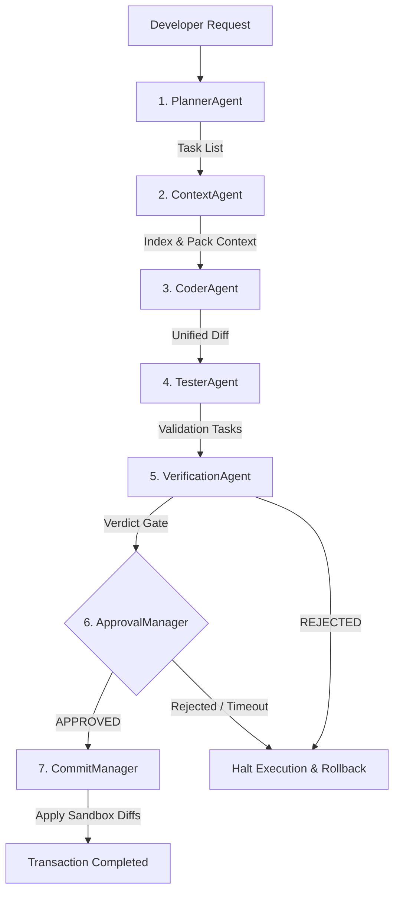

# BBC-AOS: Best-practice Blast-radius Codebase Agentic Orchestration System

BBC-AOS is a production-grade, highly deterministic agentic orchestration platform designed to automate codebase modifications under strict safety guardrails. By combining static symbol-graph extraction, context compilation, and transactional commit pipelines, BBC-AOS guarantees mathematical reproducibility, context efficiency, and zero AI-hallucinated file edits.

---

## 1. What is BBC-AOS?

BBC-AOS operates as a sidecar agent orchestration system. It wraps LLM reasoning within a mathematically defined compiler shell, preventing common agent errors such as file compilation breakdown, circular imports, invalid edits, and hallucinated file creations.

---

## 2. Why BBC-AOS?

In legacy agent pipelines, entire files are fed into context windows, leading to context pollution and massive token costs. BBC-AOS utilizes a `ContextOptimizer` and `SemanticPacker` to reduce context size.
* **Average Context Reduction**: **58.6%**
* **Average Token Savings**: **23.3%**
* **Fidelity**: 100% of critical code dependency paths are preserved during packing.

---

## 3. Installation

Install the package via pip:
```bash
pip install bbc-aos
```

---

## 4. Quick Start

Initialize a new project, index symbols, and ask questions:
```bash
bbc init
bbc index .
bbc ask "add jwt authentication"
```

---

## 5. Architecture Overview

BBC-AOS separates execution concerns into sequential agent stages and transaction controllers:



---

## 6. Hallucination Prevention

By parsing codebase imports and verifying SimHash code fingerprints, the system enforces strict guardrails against hallucinated files and symbols.
* **Hallucinated File Access**: **0%**
* **Circular / Malformed Imports**: **0%**
* **Invalid Symbol References**: **0%**

---

## 7. Token Reduction

Through active AST dependency pruning and semantic collapsing, the packer achieves high compression rates:
* **Safe Mode Token Savings**: **23.3%**
* **Aggressive Mode Token Savings**: **Up to 45%**

---

## 8. Replay System

Audit logs record byte-for-byte state transitions. Re-running a task with the recorded `replay_id` re-executes the exact sequence of agent decisions, producing matching patch signatures and verification hashes.
* **Replay Fidelity Score**: **1.0 (100%)**

---

## 9. Obsidian Integration

Connects your code memory with your Obsidian knowledge vault:
* Configure your vault path: `bbc obsidian connect /path/to/vault`
* Promoted code designs are exported as markdown files containing frontmatter tags.

---

## 10. CLI Reference

* `bbc init`: Initialize a new BBC-AOS workspace.
* `bbc index <path>`: Index codebase symbols and compile the semantic memory map.
* `bbc ask "<query>"`: Run E2E orchestrator pipeline for a task.
* `bbc ask --shadow "<query>"`: Run the full pipeline without approval, commit, or file writes.
* `bbc doctor`: Verify health check parameters across all subsystems.
* `bbc replay <replay_id>`: Reconstruct events from audit log.
* `bbc benchmark`: Execute performance and token compression benchmarks.
* `bbc audit`: Show execution, failure, rollback, and rejection metrics.
* `bbc failures`: List persistent failure-memory records.
* `bbc failures search "<query>"`: Search recurring failure patterns.
* `bbc wiki status`: Show BBC Knowledge Vault health.
* `bbc wiki search "<query>"`: Search vault lessons, concepts, entities, and executions.
* `bbc obsidian connect <vault_path>`: Connect local vault.
* `bbc obsidian setup-git`: Guide Obsidian Git backup setup without configuring GitHub sync automatically.

---

## 11. Safety Guarantees

* **Fail-Closed Execution**: Any compiler error or safety rule violation immediately halts execution.
* **Immutable Working Checkpoints**: Temporary changes are stored in isolated sandboxes and rolled back on failures.
* **Human-in-the-Loop Approval**: Medium, High, and Critical risk tasks are blocked by a commit manager pending developer sign-off.

---

## 12. Benchmarks

* **E2E Pipeline Determinism**: **100.0%** (proven over 400 execution runs across 4 distinct scenarios).
* **Recovery Reliability**: **1.0 (100%)** recovery success under 8 mandatory chaos scenarios.

---

## 13. Limitations

* Multi-language projects are parsed with custom regex mapping but full semantic symbol graph construction is optimized primarily for Python codebases.
* Replay systems depend on local `.bbc` audit logs; moving or deleting the audit directories prevents historical reconstruction.
* BBC-AOS does not auto-commit by default. Every commit path requires explicit user approval.
* BBC-AOS does not configure GitHub sync for Obsidian. Use the Obsidian Git plugin under your own control.

---

## 14. FAQ

### Can I run BBC-AOS on Windows?
Yes, BBC-AOS is fully certified on Windows, macOS, and Linux.

### Does it modify my active Git repository?
No, it runs in a sandbox workspace and requires explicit human approval before modifications are transactionally committed.

---

## 15. License

Distributed under the MIT License. See `LICENSE` for more information.

---

## 16. Security Guardrails

BBC-AOS blocks dangerous patch patterns before approval, including `.env` writes, `os.system`, subprocess shell calls, `rm -rf`, `shutil.rmtree`, `eval`, `exec`, and `pickle.loads`.

It also checks workspace boundaries, blast radius permissions, allowed file extensions, unknown files, and unknown imports.

---

## 17. VS Code Extension

The local extension scaffold lives in `ide/vscode-bbc-aos`.

Commands:
* `BBC-AOS: Ask`
* `BBC-AOS: Index`
* `BBC-AOS: Vault Status`
* `BBC-AOS: Doctor`

---

## 18. BBC Daemon

Safe interactive daemon usage:

```bash
bbc daemon start
bbc daemon start --goal "fix login bug" --max-iter 3
bbc daemon status
bbc daemon stop
```

The daemon does not auto-commit by default. `--auto-approve` only allows LOW-risk continuation and does not bypass verification.

---

## 19. Obsidian + Git Backup

BBC Knowledge Vault defaults to `~/BBC_KNOWLEDGE`, outside the project directory.

```bash
bbc wiki status
bbc wiki search "jwt"
bbc obsidian setup-git
```

`bbc obsidian setup-git` checks Git and the vault repository state, then recommends the Obsidian Git plugin. BBC-AOS does not write GitHub sync settings.

---

## 20. Real Repository Benchmarks

Phase C8 is documented in `docs/real_repository_benchmark_suite.md`. It compares BBC OFF vs BBC ON across Django, FastAPI, Requests, Flask, and React using hallucinated files, wrong edits, token usage, rollback rate, human rejection rate, and latency.

---

## 21. Reflection, Failure Memory, And Shadow Mode

BBC-AOS now records deterministic post-run reflections through `ReflectionAgent`.

Reflection outputs include:
* success patterns
* failure patterns
* lessons learned
* recommendations
* future risks
* deterministic hash

Recurring failures are stored in `.bbc/failure_memory.jsonl`. Repeated failures increment `occurrence_count`, making recurring issues such as missing imports, invalid symbols, blast-radius violations, verification rejections, patch conflicts, approval timeouts, and checkpoint corruption visible over time.

Shadow mode is available for safe evaluation:

```bash
bbc ask --shadow "fix login bug"
```

Shadow mode runs Planner, Context, Coder, Tester, and Verification, but performs no approval request, no commit, and no file write.

---

## 22. Architectural Invariants

BBC-AOS supports architectural invariant checks through `.bbc/invariants.yaml`.

Supported controls:
* `forbidden_paths`
* `must_not_modify`
* `max_files_per_commit`
* `require_tests`
* `require_docstrings`
* `forbidden_imports`

Verification rejects execution when invariant violations are detected before approval.

---

## 23. Audit And Observability

The audit surface summarizes operational health:

```bash
bbc audit
```

Metrics include executions, success rate, failure percentage, rollback count, most modified file, most common failure, average latency, and human rejection rate.
