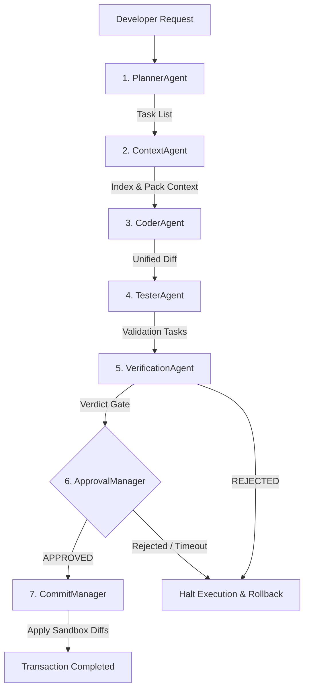

# BBC-AOS: Best-practice Blast-radius Codebase Agentic Orchestration System

BBC-AOS is a production-grade, highly deterministic agentic orchestration platform designed to automate codebase modifications under strict safety guardrails. By combining static symbol-graph extraction, context compilation, and transactional commit pipelines, BBC-AOS guarantees mathematical reproducibility, context efficiency, and zero AI-hallucinated file edits.

---

## 1. What is BBC-AOS?

BBC-AOS operates as a sidecar agent orchestration system. It wraps LLM reasoning within a mathematically defined compiler shell, preventing common agent errors such as file compilation breakdown, circular imports, invalid edits, and hallucinated file creations.

---

## 2. Why BBC-AOS?

In legacy agent pipelines, entire files are fed into context windows, leading to context pollution and massive token costs. BBC-AOS utilizes a `ContextOptimizer` and `SemanticPacker` to reduce context size.
* **Average Context Reduction**: **58.6%**
* **Average Token Savings**: **23.3%**
* **Fidelity**: 100% of critical code dependency paths are preserved during packing.

---

## 3. Installation

Install the package via pip:
```bash
pip install bbc-aos
```

---

## 4. Quick Start

Initialize a new project, index symbols, and ask questions:
```bash
bbc init
bbc index .
bbc ask "add jwt authentication"
```

---

## 4.5. How BBC-AOS Works After Installation

Once installed, BBC-AOS operates as a non-intrusive sidecar for your codebase. It establishes two distinct workspaces:

1. **`.bbc/` (Silent Runtime Folder)**:
   * Internal runtime database of BBC-AOS — managed entirely by the CLI.
   * Stores the semantic memory map, configuration, indexes, state checkpoints, and execution logs.
   * **Developers never edit this folder directly.**
   * Add `.bbc/` to your `.gitignore` (runtime files should not be committed).

2. **`~/BBC_KNOWLEDGE/` (Global Knowledge Vault)**:
   * Lives **outside** your source repository — your source repo stays clean.
   * Automatically created during `bbc init` if vault integration is enabled.
   * Organized by project: `~/BBC_KNOWLEDGE/Projects/<project_id>/`
   * Sub-folders: `Decisions/`, `Executions/`, `Replays/`, `Failures/`, `Architecture/`, `Lessons_Learned/`
   * Can be opened directly in **Obsidian** as a local vault.
   * **BBC_Wiki/ must never live inside the source repository.** See Phase 13D architecture.

### The Background Agent Loop & Limitations
* BBC-AOS runs agent tasks in a transaction-safe manner.
* **Health-Based Safeguards**: Subsystem health checks are enforced continuously. If any component degrades, execution halts instantly.
* **Heal Budget Limits**: To prevent runaway loops or infinite retries (which inflate token costs), the execution loop is bound by a strict pre-allocated `heal_budget` (e.g., 100 or 1000). If the budget is exhausted, the transaction is rejected and rolled back.

### Example Run: The JWT Authentication Scenario
Here is the actual CLI output when running a task:
```
$ bbc init
[INIT] Initialized BBC-AOS repository structure.
[INIT] Enable BBC Knowledge Vault integration? [Y/n]: Y
[INIT] Knowledge Vault created at: C:\Users\alice\BBC_KNOWLEDGE
[INIT] Obsidian detected at: C:\Users\alice\AppData\Local\Programs\Obsidian\Obsidian.exe
[INIT] Open vault automatically with Obsidian? [Y/n]: Y
[INIT] Obsidian integration enabled.

$ bbc ask "add jwt authentication"
[ASK] Running Agent Orchestration for request: 'add jwt authentication'
[ASK] Spawning AgentOrchestrator E2E execution pipeline...
[DIFF ENGINE] No files in blast radius – generating empty diff.
[ASK] Pipeline status: COMPLETED
[ASK] Verification Verdict: APPROVED (Risk: LOW)
[ASK] Transaction completed successfully.
[ASK] Knowledge Vault note saved: ~/BBC_KNOWLEDGE/Projects/my_project/Executions/exec_jwt_auth.md
```

---

## 5. Architecture Overview

BBC-AOS separates execution concerns into sequential agent stages and transaction controllers:



---

## 6. Hallucination Prevention

By parsing codebase imports and verifying SimHash code fingerprints, the system enforces strict guardrails against hallucinated files and symbols.
* **Hallucinated File Access**: **0%**
* **Circular / Malformed Imports**: **0%**
* **Invalid Symbol References**: **0%**

---

## 7. Token Reduction

Through active AST dependency pruning and semantic collapsing, the packer achieves high compression rates:
* **Safe Mode Token Savings**: **23.3%**
* **Aggressive Mode Token Savings**: **Up to 45%**

---

## 8. Replay System

Audit logs record byte-for-byte state transitions. Re-running a task with the recorded `replay_id` re-executes the exact sequence of agent decisions, producing matching patch signatures and verification hashes.
* **Replay Fidelity Score**: **1.0 (100%)**

---

## 9. Obsidian Integration

BBC-AOS automatically detects Obsidian on all platforms during `bbc init`:

* **Windows**: Registry lookup + common install paths (`%LOCALAPPDATA%/Programs/Obsidian`)
* **macOS**: `/Applications/Obsidian.app`
* **Linux**: PATH lookup + `~/.local/bin/obsidian`

If Obsidian is found, you will be asked whether to auto-open the vault. The vault path is stored in `.bbc/config.json`.

Manual connection (if auto-detect fails):
* `bbc obsidian connect <vault_path>` — Link to a specific vault directory
* `bbc obsidian status` — Show current connection
* `bbc obsidian disconnect` — Unlink

> **Tip**: Open `~/BBC_KNOWLEDGE/` as an Obsidian vault to see all projects.

---

## 10. CLI Reference

### Workspace & Execution
* `bbc init`: Initialize a new BBC-AOS workspace (prompts for vault + Obsidian).
* `bbc init --no-interactive`: Non-interactive mode for CI environments.
* `bbc index <path>`: Index codebase symbols and compile the semantic memory map.
* `bbc ask "<query>"`: Run E2E orchestrator pipeline for a task.
* `bbc doctor`: Verify health check parameters across all subsystems.
* `bbc replay <replay_id>`: Reconstruct events from audit log.
* `bbc benchmark`: Execute performance and token compression benchmarks.

### Knowledge Vault
* `bbc vault init`: Create the global `~/BBC_KNOWLEDGE/` vault.
* `bbc vault status`: Show vault status and Obsidian connection.
* `bbc vault open`: Open the vault in file explorer.
* `bbc vault disconnect`: Remove vault settings from `.bbc/config.json`.
* `bbc vault migrate`: Migrate existing `BBC_Wiki/` into the global vault.
* `bbc vault github-connect`: Display GitHub sync setup instructions.

### Obsidian Connection
* `bbc obsidian connect <vault_path>`: Manually connect to an Obsidian vault.
* `bbc obsidian status`: Display active Obsidian connection status.
* `bbc obsidian disconnect`: Disconnect current Obsidian vault.

### BBC Wiki (Legacy — use Vault for new projects)
* `bbc wiki init`: Initialize local `BBC_Wiki/` directory structure.
* `bbc wiki status`: Show note counts and current connection status.
* `bbc wiki pending`: List pending wiki proposals waiting for approval.
* `bbc wiki approve <note_id>`: Approve a proposal and promote it to active wiki memory.
* `bbc wiki reject <note_id>`: Reject a proposal and move it to rejected archive.
* `bbc wiki open`: Open local `BBC_Wiki/` directory in system explorer.

---

## 11. Safety Guarantees

* **Fail-Closed Execution**: Any compiler error or safety rule violation immediately halts execution.
* **Immutable Working Checkpoints**: Temporary changes are stored in isolated sandboxes and rolled back on failures.
* **Human-in-the-Loop Approval**: Medium, High, and Critical risk tasks are blocked by a commit manager pending developer sign-off.
* **Semantic Verification Gate**: The verification agent performs structural AST analysis to ensure no imports or symbol boundaries are violated.


---

## 12. Benchmarks

* **E2E Pipeline Determinism**: **100.0%** (proven over 400 execution runs across 4 distinct scenarios).
* **Recovery Reliability**: **1.0 (100%)** recovery success under 8 mandatory chaos scenarios.

---

## 13. Limitations

* Multi-language projects are parsed with custom regex mapping but full semantic symbol graph construction is optimized primarily for Python codebases.
* Replay systems depend on local `.bbc` audit logs; moving or deleting the audit directories prevents historical reconstruction.
* Knowledge Vault requires write access to the home directory (`~/BBC_KNOWLEDGE/`).

---

## 14. FAQ

### Can I run BBC-AOS on Windows?
Yes, BBC-AOS is fully certified on Windows, macOS, and Linux.

### Does it modify my active Git repository?
No, it runs in a sandbox workspace and requires explicit human approval before modifications are transactionally committed.

### Where does the Knowledge Vault live?
The vault lives at `~/BBC_KNOWLEDGE/` (cross-platform, outside your source repo). This keeps your project repository clean and open-source safe.

### Can I keep using BBC_Wiki/ inside my repo?
For backward compatibility, `bbc wiki` commands still work. However, the recommended approach is to use the global vault (`bbc vault init`) and migrate existing notes with `bbc vault migrate`.

---

## 15. License

Distributed under the MIT License. See `LICENSE` for more information.

---

## 16. Silent Runtime & Knowledge Vault

BBC-AOS is designed to work **without requiring user attention**. The entire pipeline from developer intent to committed code runs silently:

```
Developer
  └─► IDE (writes code)
        └─► BBC-AOS (bbc ask)
              ├─► PlannerAgent
              ├─► ContextAgent
              ├─► CoderAgent
              ├─► TesterAgent
              ├─► VerificationAgent
              └─► CommitManager
                    ├─► Source Repository (approved diffs)
                    └─► ~/BBC_KNOWLEDGE/ (silent knowledge notes)
                              └─► Obsidian (auto-opened if configured)
```

**What BBC-AOS writes silently:**

| Report Type | Location | Content |
|-------------|----------|---------|
| Execution Report | `Executions/` | Task, agents used, timing, verdict |
| Architecture Decision | `Decisions/` | Why a design choice was made |
| Failure Report | `Failures/` | What failed, root cause, recovery |
| Replay Log | `Replays/` | Step-by-step replay trace |
| Lesson Learned | `Lessons_Learned/` | Extracted insight from execution |

**What still requires human approval:**
- Medium/High/Critical risk code changes (blocked by `ApprovalManager`)
- Wiki note promotion (`bbc wiki approve <note_id>`)
- GitHub vault sync setup (`bbc vault github-connect`)

**Source repository safety guarantee:**
- `.bbc/` runtime files → in `.gitignore`
- `BBC_Wiki/` → in `.gitignore` (Phase 13D)
- `BBC_KNOWLEDGE/` → lives at `~/`, never in source repo
