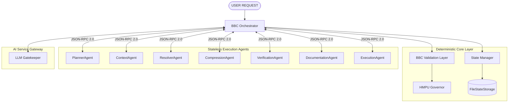

# Agent Architecture Specification - Phase 7A

This document defines the structural map of the Agent Layer in the `bbc_aos` framework. It governs the relationship between the central orchestrator, stateless agents, the validation gateway, and state memory boundaries.

## 1. Architectural Principles

The Agent Layer is constructed according to the following design constraints:
1. **Stateless Executions:** Agents hold no internal runtime state or session context. All execution contexts are passed explicitly within each invocation contract.
2. **Centralized Routing:** The **BBC Orchestrator** is the only coordinator. Direct agent-to-agent calling is strictly forbidden.
3. **Deterministic Verification Gatekeeper:** All inputs and outputs must pass through the **BBC Core Validation Layer** (integrating `RecipeValidator`, `HMPU_Governor`, and `HallucinationGuard`) before executing or committing.
4. **LLM Output Sandboxing:** No agent may access raw LLM outputs. The verification gateway handles parsing, schema compliance, and semantic soundness checks.

---

## 2. System Architecture Diagram

---

## 3. Interaction Flow

* **Step 1: Ingestion:** The `Orch` receives a task, registers a new session ID with the `StateManager`, and decomposes the task using `PlannerAgent`.
* **Step 2: Execution:** The `Orch` queries the required context via `ContextAgent` and processes dependencies via `ResolverAgent`.
* **Step 3: Optimization:** The `Orch` routes context payloads to `CompressionAgent` for token minimization.
* **Step 4: LLM Query:** The `Orch` calls the `LLM Gatekeeper` with the optimized prompt.
* **Step 5: Verification:** The raw output is immediately intercepted by the `Orch` and sent to `VerificationAgent` for hallucination detection.
* **Step 6: Modification & Documentation:** If validated, the patch is applied by `ExecutionAgent`, and memory/obsidian files are updated by `DocumentationAgent`.
