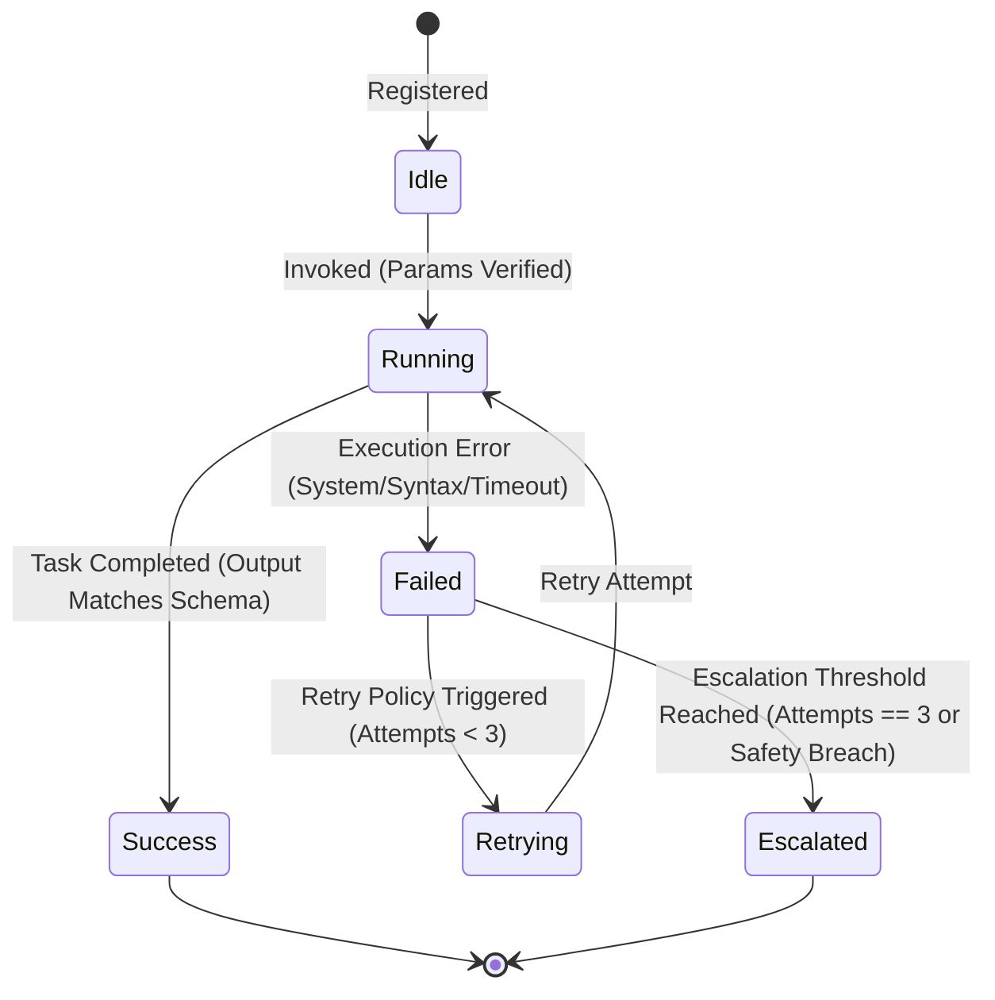

# Agent Execution Lifecycle Specification - Phase 7A

This document defines the execution states, transition constraints, retry policies, and error escalation procedures for the BBC-AOS Agent Layer.

---

## 1. Agent Lifecycle States

A stateless agent invocation transitions through the following lifecycle states under the control of the orchestrator:

* **`Idle`:** Agent class is initialized and registered with the Orchestrator's allowlist.
* **`Running`:** The Orchestrator has validated the JSON-RPC input schema and dispatched the request parameters to the agent.
* **`Success`:** The agent finished execution, and the output payload has successfully passed schema and validation signature checks.
* **`Failed`:** An execution error, syntax exception, or validation failure has occurred during execution.
* **`Retrying`:** The Orchestrator has halted the failure state and is preparing to re-invoke the agent with adjusted prompts or settings.
* **`Escalated`:** The task has failed critical retries or triggered a safety violation. The Orchestrator aborts the pipeline, logs alerts, and prompts the user for intervention.

---

## 2. Retry & Backoff Policies

To recover from transient AI errors (e.g. malformed JSON, minor syntax issues), the Orchestrator implements a **Deterministic Retry Policy**:
* **Maximum Attempts:** 3.
* **Backoff Strategy:** None (Immediate replay or temperature adjustments in the next prompt context).
* **Retry Criteria:** Retries are allowed only for:
  * Malformed JSON outputs (schema validation failures).
  * Syntactically invalid code patches (ast parsing failures).
  * Missing required output parameters.
* **Prohibited Retries:** Retries are forbidden for:
  * **Safety Violations:** Any attempt to read or write outside the sandbox path.
  * **CVP Breaches:** Repeated hallucination detections or critical state degenerations.
  * **Authentication/System Errors:** Internal disk exceptions.

---

## 3. Escalation Protocols

If a failure cannot be resolved within the retry limits or a critical rule is violated, the Orchestrator executes the **Escalation Protocol**:

1. **Transaction Rollback:** All uncommitted changes proposed during the active transaction are discarded. The `StateManager` resets changes to the last verified checkpoint.
2. **Telemetry Log Event:** A structured log event of type `ESCALATION_TRIGGERED` is written to `telemetry.jsonl`.
3. **Escalation Status Reporting:** The Orchestrator raises a standard JSON-RPC error payload containing a detailed breakdown of the failure.
4. **User Intervention Prompt:** The pipeline stops and waits for manual user review and approval before execution can resume.
