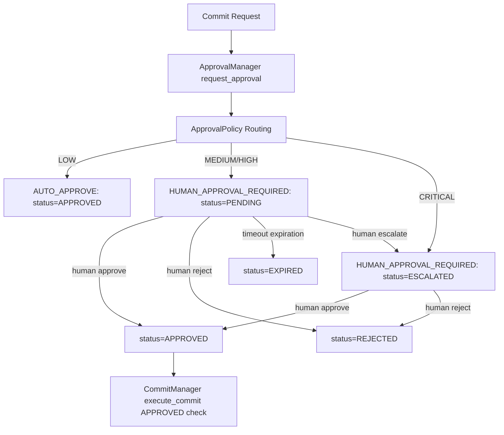

# Human Approval Gates Implementation Report - Phase 11H

This report describes the architecture, design choices, and implementation details of the human approval gates subsystem under `bbc_aos/approval/`.

---

## 1. Subsystem Architecture

The human approval subsystem introduces a gating policy layer for write transactions. It ensures that no write commit can be executed without passing through the approval gates first.

### Components
1. **`ApprovalManager` (`approval_manager.py`):** Central gatekeeper managing requests, transitions, and history rollback stacks.
2. **`ApprovalPolicy` (`approval_policy.py`):** Dictates initial routing status based on the transaction risk classification.
3. **`ApprovalRequest` (`approval_request.py`):** Model for approval records with custom deep-copy capabilities for slotted attributes.
4. **`ApprovalResult` (`approval_result.py`):** Immutable value object representing a gate resolution result.
5. **`ApprovalCheckpoint` (`approval_checkpoint.py`):** Snapshots request mappings to allow undoing/rolling back pending actions.
6. **`ApprovalAuditLog` (`approval_audit_log.py`):** Logs state transitions to `.bbc/approval_audit.jsonl`.
7. **`ApprovalException` (`approval_exceptions.py`):** Custom subsystem exception classes.

---

## 2. Integration & Compliance

* **Write Permission Gate:** `CommitManager` constructor has been extended to accept `approval_manager`. When executing/dry-running commits, `CommitManager` strictly checks if the associated `approval_id` status is `APPROVED`.
* **Trace Replay Audit Log:** The manager appends `ROLLED_BACK` transitions to the audit log upon rollback, ensuring audit compatibility.
* **No UI Required:** Transition triggers (`approve`, `reject`, `timeout`, `escalate`) are exposed strictly via Python API.
