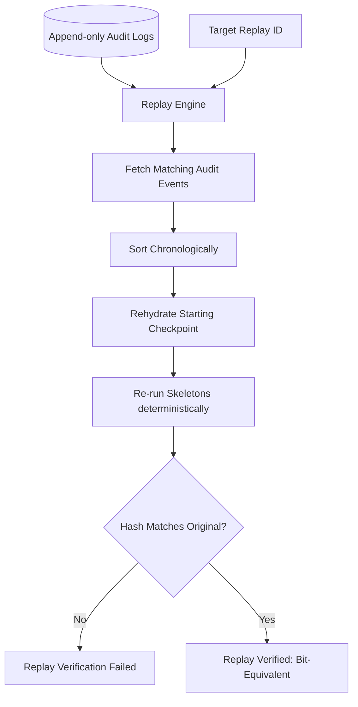
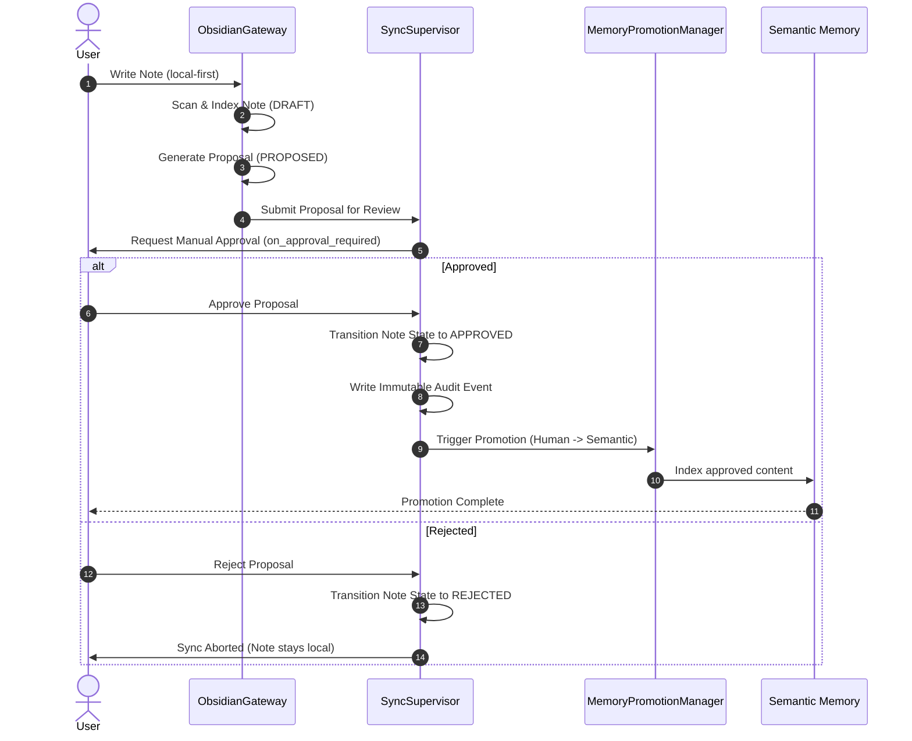

# Audit and Replay Flow - Phase 9A

This document details the audit logging, deterministic replays, and human knowledge promotion flows.

## 1. Replay Flow Sequence

Replay is designed to reconstruct system state byte-for-byte using append-only logs:

1. **Replay Initiation:** Client calls the replay engine providing a target `replay_id` or `trace_id`.
2. **Fetch Audit History:** The replay engine queries the append-only `ObsidianAuditLog` and `MemoryAuditLog` for all events matching the target identifier.
3. **Sequence Alignment:** Events are sorted chronologically by timestamp and sequence index.
4. **Reconstruct Context:** System state is rehydrated to the starting checkpoint of the session.
5. **Deterministic Re-execution:** The replay engine feeds inputs from audit history to the registries and engine to reconstruct the exact execution trace.
6. **Assertion Verification:** Resulting hashes are verified against the original logged `deterministic_hash`.

### Replay Flow Diagram

---

## 2. Human Knowledge Flow Sequence

Promoting knowledge from user vaults to system semantic memory requires strict approval gates:

1. **Write Local Note:** User drafts or updates a note in the local-first Obsidian vault.
2. **Scan and Index:** `VaultIndexer` catalogues the note, detecting new versions or drafts.
3. **Propose Changes:** `SyncPlanner` generates a change proposal (`ProposalArtifact`) for the orchestrator.
4. **Approval Request:** The orchestrator presents the proposal to the user (triggering the `on_approval_required` hook).
5. **Human Decision:**
   * *Rejected:* Note transitions to `REJECTED` state and stays local.
   * *Approved:* Note transitions to `APPROVED` and sync commits.
6. **Promotion Execution:** The `MemoryPromotionManager` promotions workflow is triggered to safely index the approved note into Semantic Memory.

### Human Knowledge Flow Diagram

