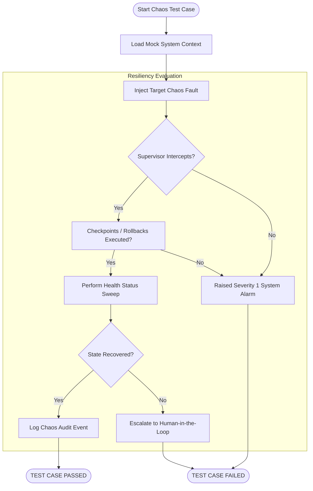

# Chaos Engineering Strategy - Phase 10A

This document details the chaos engineering strategy, containing inject-verify sequences for the eight mandatory chaos scenarios.

## 1. Mandatory Chaos Scenarios

The certification suite must inject failures to verify system stability under the following conditions:

1. **Corrupted Checkpoints:** Inject invalid state hashes into `LoopCheckpoint` files. The system must reject the checkpoint and roll back to the parent.
2. **Corrupted Memory Records:** Corrupt the version count or payload of historical `MemoryRecord` elements. The system must raise integrity alarms and halt promotion.
3. **Corrupted Audit Logs:** Append conflicting event hashes to append-only logs. The system must detect hash mismatches during E2E rehydration and trigger replay failure hooks.
4. **Missing Subsystem:** Unregister a required subsystem (e.g. `memory`) from `SubsystemRegistry`. The orchestrator must block dispatches and transition to `UNHEALTHY` status.
5. **Startup Failures:** Simulate a dependency fault (e.g. core weight loading fails) during startup sequence. The system must block subsequent steps and fail gracefully.
6. **Shutdown Failures:** Force a blocked thread during loops draining. The supervisor must enforce timeout cancellations and complete shutdown.
7. **Replay Failures:** Attempt replay on corrupted log traces. The replay engine must raise `IntegrationValidationException` and log the incident.
8. **Approval Timeouts:** Simulate user approval timeout during knowledge promotions. The supervisor must auto-reject the promotion and abort the transaction.

---

## 2. Chaos Testing Workflow Diagram

