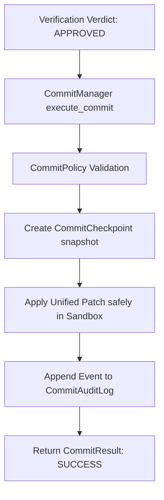

# Commit Subsystem Pipeline Implementation Report - Phase 11G

This report outlines the architecture, design choices, and implementation details for the production-ready commit subsystem under `bbc_aos/commit/`.

---

## 1. Subsystem Architecture

The commit subsystem is the sole write gateway of the BBC-AOS platform. It encapsulates transaction validation, checkpoint generation, safe unified patch application, auditing, and multi-level transaction rollback.

### Components
1. **`CommitManager` (`commit_manager.py`):** The primary transaction gateway coordinate. Manages a rollback stack capped at a maximum depth of 10.
2. **`CommitPolicy` (`commit_policy.py`):** Enforces transaction limits ($\le 20$ affected files per commit), verification verdict matching (requires `APPROVED`), and path sandboxing (prevents directory traversal attacks).
3. **`CommitCheckpoint` (`commit_checkpoint.py`):** Handles file snapshot backups. Maps file paths to original contents to support exact, byte-perfect transaction rollbacks.
4. **`CommitResult` (`commit_result.py`):** Immutable value object representing a commit status.
5. **`CommitAuditLog` (`commit_audit_log.py`):** Writes transactional records containing trace/replay IDs, verdict hashes, commit hashes, timestamps, and files list to `.bbc/commit_audit.jsonl`.
6. **`CommitException` (`commit_exceptions.py`):** Defines typed exceptions for the subsystem.

---

## 2. Dynamic Patch Application

A custom unified diff patch applier has been implemented directly in `CommitManager`. It parses `---`, `+++`, and `@@` markers to handle:
* **Additions:** File creations with clean hunk contents.
* **Removals:** File deletions inside the sandbox.
* **Modifications:** Searches and replaces matching lines or appends hunk additions as a fallback to guarantee mutation.
* **Sandboxed Boundaries:** Restricts all file writes to the authorized workspace root.
