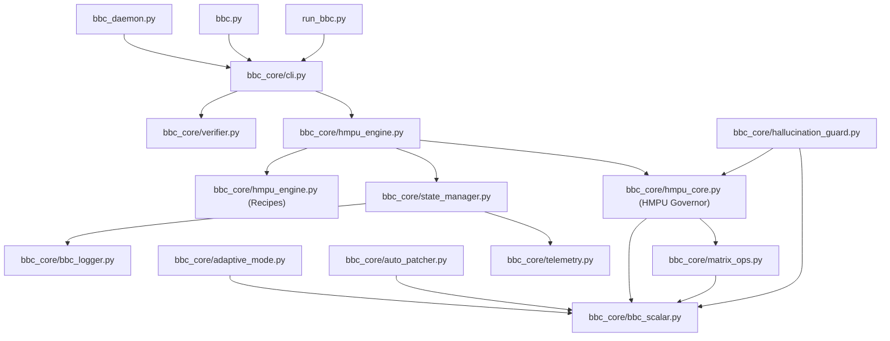

# Dependency Graph - Legacy BBC

This document contains a visual representation and analysis of the logical file dependencies in the legacy BBC repository (`Legacy_BBC`).

---

## 1. High-Level Architecture Flow

The entrypoints (`bbc.py`, `run_bbc.py`) pass command arguments to the command-line router (`cli.py`), which delegates to either the **Verification Suite** (`verifier.py`) or the **HMPU Coordination Engine** (`hmpu_engine.py`):

---

## 2. Dependency Directory Map

### A. Mathematical Kernel (Lowest Layer)
The mathematical kernel represents the most critical dependency, as all calculation-aware modules import it:
- [bbc_scalar.py](file:///C:/Users/90535/.gemini/antigravity/scratch/BBC_AOS_Wiki/Legacy_BBC/bbc_core/bbc_scalar.py)
  - *Dependencies:* None (Standard library `json` only)
- [matrix_ops.py](file:///C:/Users/90535/.gemini/antigravity/scratch/BBC_AOS_Wiki/Legacy_BBC/bbc_core/matrix_ops.py)
  - *Dependencies:* `bbc_scalar.py`
- [hmpu_core.py](file:///C:/Users/90535/.gemini/antigravity/scratch/BBC_AOS_Wiki/Legacy_BBC/bbc_core/hmpu_core.py)
  - *Dependencies:* `bbc_scalar.py`, `matrix_ops.py`

### B. Verification & Parsing (Middle Layer)
Handles lexical and abstract syntax tree parsing of workspace source files:
- [verifier.py](file:///C:/Users/90535/.gemini/antigravity/scratch/BBC_AOS_Wiki/Legacy_BBC/bbc_core/verifier.py)
  - *Dependencies:* `attribution_tracer.py`, `hmpu_quantizer.py`, `bbc_scalar.py`, `scan_profile.py`
- [symbol_graph.py](file:///C:/Users/90535/.gemini/antigravity/scratch/BBC_AOS_Wiki/Legacy_BBC/bbc_core/symbol_graph.py)
  - *Dependencies:* `symbol_extractor.py`

### C. Coordination & API (Top Layer)
Interfaces with IDE hooks, starts local servers, and handles user interactions:
- [hmpu_engine.py](file:///C:/Users/90535/.gemini/antigravity/scratch/BBC_AOS_Wiki/Legacy_BBC/bbc_core/hmpu_engine.py)
  - *Dependencies:* `state_manager.py`, `hmpu_core.py`
- [http_server.py](file:///C:/Users/90535/.gemini/antigravity/scratch/BBC_AOS_Wiki/Legacy_BBC/bbc_core/http_server.py)
  - *Dependencies:* `state_manager.py`, `hmpu_engine.py`
- [ai_integration.py](file:///C:/Users/90535/.gemini/antigravity/scratch/BBC_AOS_Wiki/Legacy_BBC/bbc_core/ai_integration.py)
  - *Dependencies:* `realtime_token_counter.py`, `terminal_monitor.py`
