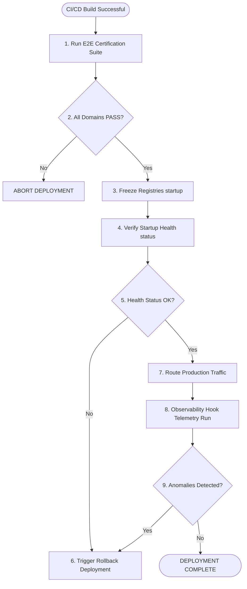

# Deployment Readiness Checklist - Phase 10A

This document outlines the acceptance criteria, rollback procedures, and the production deployment workflow.

## 1. Production Acceptance Criteria

Before any code deployment to production, the system must satisfy the following thresholds:

* **Fidelity Metric:** 100% equivalence match on all core core calculations.
* **Variance Metric:** Zero variance (variance = 0) in 100 consecutive runs on certification datasets.
* **RTO Limit:** Recovery time from checkpoints under **500ms**.
* **Zero Automatic Merges:** Enforced by supervisor validations (100% pass on block tests).
* **Sandbox Verification:** zero writes permitted outside approved sandbox paths.

---

## 2. Production Deployment Workflow Diagram

---

## 3. Deployment Checklist

### Pre-Deployment Tasks
* `[ ]` Execute E2E certification test suite locally and in staging environments.
* `[ ]` Verify that all reports (Phase 1 to Phase 9) are frozen.
* `[ ]` Verify directory sandbox parameters are set to read-only for system directories.
* `[ ]` Confirm that no LLM autonomous execution logic is present in active code modules.

### Deployment Tasks
* `[ ]` Deploy the modular package codes (`bbc_aos/core/`, `loops/`, `memory/`, `knowledge/`, `integration/`).
* `[ ]` Run startup sequencing tests, verifying registry freezes.
* `[ ]` Query subsystem health status endpoints (`HealthManager.check_subsystem_health()`).

### Post-Deployment Tasks
* `[ ]` Perform 5 test transactions with tracing UUIDs.
* `[ ]` Run ReplayEngine to verify that test transactions re-execute and match hashes.
* `[ ]` Verify that the append-only `IntegrationAuditLog` has compiled all step entries.
