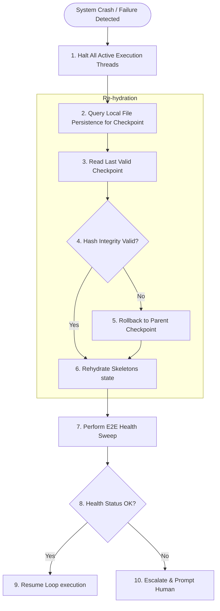
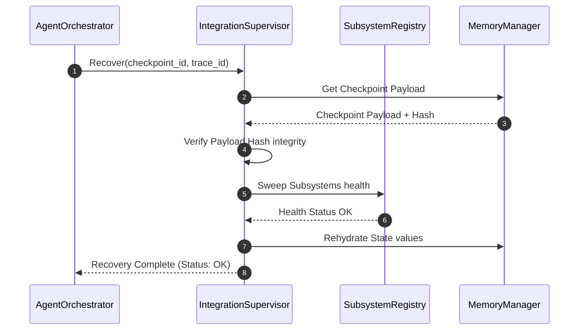

# Disaster Recovery Strategy - Phase 10A

This document details the disaster recovery models, objectives, and rollback procedures for BBC-AOS.

## 1. Recovery Objectives and SLAs

* **Recovery Time Objective (RTO):** The maximum tolerable duration to restore system execution from a crash is **< 500ms** (excluding human approval gates).
* **Recovery Point Objective (RPO):** The maximum data loss limit is **0 records**. The system preserves this via append-only logs and immediate checkpoint commits.
* **Production SLA:** E2E system availability must meet **99.9%** stability. All calculations must remain deterministic.

---

## 2. Disaster Recovery Workflow

---

## 3. Subsystem Recovery Workflow

The sequence below runs when the supervisor initiates a recovery run:

---

## 4. Rollback Procedures

1. **State Isolation:** The active database lists are locked, preventing dirty writes.
2. **Revert State:** The engine reads the `parent_checkpoint_id` pointer from the last audited checkpoint and reverts parameters to the corresponding state snapshot.
3. **Commit Rollback Audit:** Write an immutable audit log entry documenting the rollback (`event_type: "rollback_commit"`), referencing the `trace_id` and new state hash.
4. **Notify Client:** Respond to the client with the rolled-back context ID to trigger execution restart.
