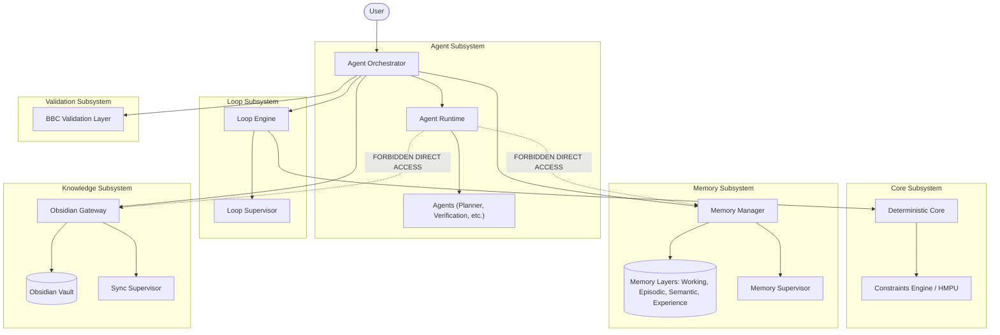

# End-to-End Integration Architecture - Phase 9A

This document details the complete end-to-end integration architecture for the BBC-AOS system, coordinating the five participating subsystems under strict isolation and orchestration rules.

## 1. Subsystem Integration Diagram

The following diagram illustrates the structural boundaries and communication paths between the subsystems. All cross-subsystem interactions must go through the `AgentOrchestrator`.

---

## 2. Mandatory Communication Rules

1. **Orchestrator Brokerage:** The `Agent Runtime` has no direct access to `Memory Runtime` or `Obsidian Runtime`. Any read, query, promotion, or write operation requested by an Agent must be sent as a message to the `AgentOrchestrator`, which routes and authorizes the request.
2. **Loop Engine Exclusivity:** All iterations, budgets, and state loops are executed strictly via the `LoopEngine`. Agents cannot loop recursively or invoke scripts directly.
3. **Memory Manager Gatekeeping:** All memory transactions (Working, Episodic, Semantic, Experience) are routed exclusively through `MemoryManager`. Direct file writes to database lists are forbidden.
4. **Obsidian Gateway Isolation:** All vault indexing, change proposal generation, sync operations, and note promotions are handled exclusively by the `ObsidianGateway`.
5. **Validation Orchestration:** All output checks, schema constraints, and verification runs are brokered through the `BBC Validation Layer` using the `VerificationAgent`.

---

## 3. Subsystem Ownership Rules

* **Deterministic Core:** Owns mathematical equivalence, condition numbers, Shannon chaos calculation, and aura calibration. It is purely functional and stateless.
* **Agent Runtime:** Owns the task planning, execution commands, and agent registration. It is transient and stateless, retaining no execution memory outside the Memory subsystem.
* **Loop Runtime:** Owns the execution state of loops, iteration budgets, and checkpoint state snapshots.
* **Memory Runtime:** Owns the append-only logs for execution histories, semantic knowledge files, and promotion state transitions.
* **Obsidian Runtime:** Owns the local markdown files, index parameters, change proposals, and human audit events. It remains isolated from Semantic memory until explicit human approval is received.
