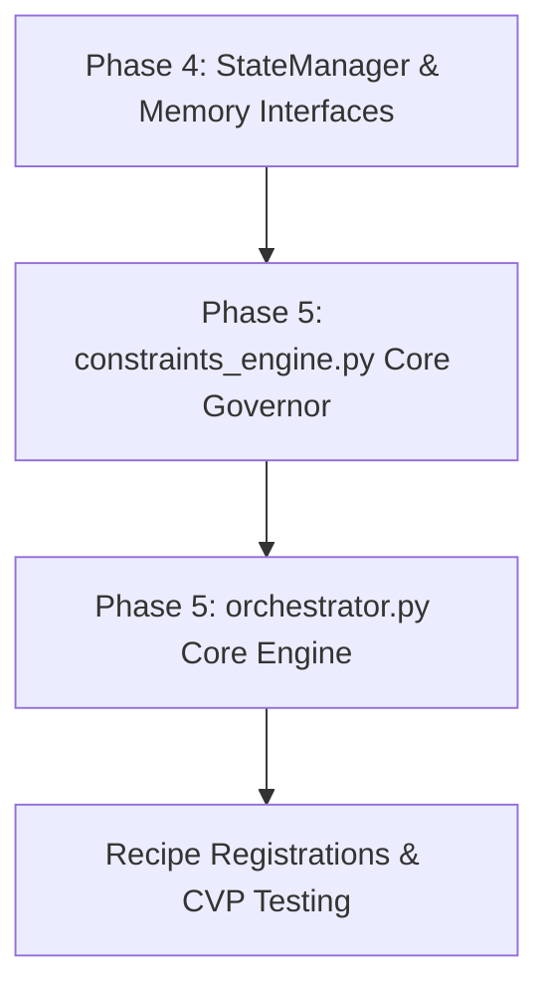

# Phase 5 Core Engine Migration Strategy

**Date:** 2026-06-24  
**Status:** Planning & Draft  

This document details the migration strategy, extraction order, adapters, potential directory violations, and rollback procedures for the most critical components of the system authority layer: `hmpu_core.py` and `hmpu_engine.py`.

---

## 1. Target Locations

Under the modular structure specified by `07_BBC-AOS Directory Structure Specification.docx`:
* **Legacy Core Component:** `Legacy_BBC/bbc_core/hmpu_core.py`  
  $\rightarrow$ **Target Location:** `bbc_aos/core/constraints_engine.py`  
  *Serves as the authoritative mathematical governor and matrix validation auditor.*
* **Legacy Engine Component:** `Legacy_BBC/bbc_core/hmpu_engine.py`  
  $\rightarrow$ **Target Location:** `bbc_aos/core/orchestrator.py`  
  *Serves as the central recipe orchestrator, dynamic constraint calibrator, and CVP executor.*

---

## 2. Mandatory Extraction Order

To execute the migration without dependency breakage, the following sequence is enforced:

1. **Verify State Persistence Interface Compliance:** Ensure that the newly developed `StateStorageInterface` and `FileStateStorage` are accessible.
2. **Migrate Core Governor (`constraints_engine.py`):**
   * Port `HMPU_Governor` class.
   * Bind matrix solvers to `bbc_aos.core.bbc_scalar` and `bbc_aos.core.matrix_ops` (both migrated in Phase 1).
   * Inject pluggable `StateManager` reference.
3. **Migrate Engine & Orchestration (`orchestrator.py`):**
   * Port recipe constraint models (`RecipeConstraint`, `BaseRecipe` and concrete subclasses).
   * Integrate `MultiRecipePipeline` logic.
   * Bind dynamic constraint adjustments to the Governor's chaos calculators.

---

## 3. Required Adapters & Bridges

To integrate the migrated engine into the AOS package:
* **Configuration Bridge:** Divert weight file loading (`hmpu_weights.json`) from relative legacy paths to directories controlled by `BBCConfig` (standardized to `.bbc/` under the workspace root).
* **Telemetry & State Bridge:** Ensure budget checks (`request_heal` and `consume_heal_budget`) cleanly reference the pluggable `StateManager` singleton without circular imports.

---

## 4. Potential Directory Law Violations

To comply with system-wide architectural laws, we must guard against:
* **Direct Agent Modification:** Worker agents under `agents/` must not bypass `orchestrator.py` to write raw recipes or manipulate budgets directly.
* **Bypassing the Validator:** Any results processed by `orchestrator.py` must eventually pass through `core/validator.py` before final output commits.

---

## 5. Migration Blockers

We identify two key blockers to address before execution:
1. **Dynamic Time Fluctuations:** The dynamic entropy micro-fluctuations added to the condition number in `get_field_stability()` (i.e. `(time.time() % 3600) / 3600000.0`) must be normalized during equivalence validation to prevent determinism failures.
2. **Missing Stats Tool Dependency:** The `get_stats()` method in `HMPUEngine` attempts to invoke an external helper `self.get_stats_tool()`. This binding must be abstracted or safely decoupled during migration.

---

## 6. Rollback Strategy

If validation checks fail during Phase 5:
* **Zero Modification Policy:** The `Legacy_BBC` source code remains completely unmodified, ensuring fallback compatibility.
* **VCS Checkpoints:** Clean branch checkouts and local files rollback will be triggered immediately to return to the verified Phase 4 state.
