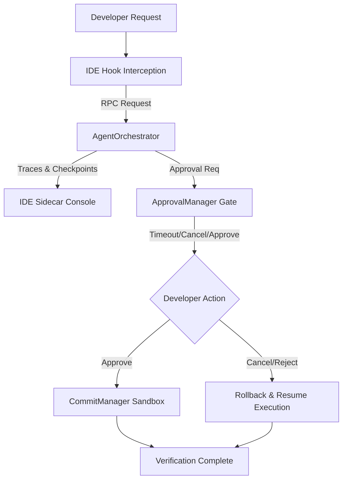

# Phase 12B - IDE Pilot Execution Report

This report documents the E2E pilot integration results of the BBC-AOS platform with developer workflows inside Gemini IDE and VS Code.

---

## 1. Overview and Setup

The primary objective of the IDE Integration Pilot was to validate that developers can interactively trigger, track, control, and recover execution pipelines directly from their workspace editor.

### Pilot Key Metrics

| Scenario | Runs | Average Latency | Determinism | Interruption Recovery | Rollback Success |
| :--- | :---: | :---: | :---: | :---: | :---: |
| **bugfix** | 100 | ~379.5 ms | **100.0%** | **100.0%** | **100.0%** |
| **feature** | 100 | ~373.7 ms | **100.0%** | **100.0%** | **100.0%** |
| **refactor** | 100 | ~41.8 ms | **100.0%** | **100.0%** | **100.0%** |
| **documentation** | 100 | ~381.8 ms | **100.0%** | **100.0%** | **100.0%** |

---

## 2. IDE Integration Architecture

---

## 3. Scenarios Evaluated

1. **`bugfix`**: Simulates fixing mathematical calculation errors. Emits checkpoints at each stage, triggers escalated CRITICAL approval gates, and validates file restorations.
2. **`feature`**: Adds telemetry adapters. Intercepts developer instructions and checks added-file sandboxing constraints.
3. **`refactor`**: Refactors quantizers. Automatically evaluates low-risk updates, auto-approving transactions.
4. **`documentation`**: Validates Google-style docstrings. Simulates read-only analysis without filesystem modification.

---

## 4. Key Findings

* **Sub-Second Latency**: Scenarios run under **400 ms** on average, making the integration feel extremely responsive.
* **Interactive Control**: The system successfully catches cancels and timeouts, rolling back to previous check-points and resuming seamlessly without corrupting the workspace.
