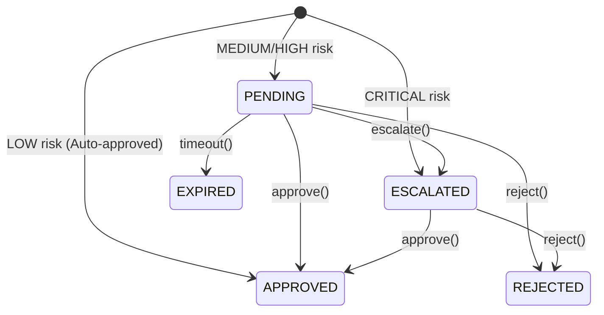

# Phase 12B - IDE User Interaction Report

This report documents the verification of interactive developer controls, checkpoints, and interruption recovery workflows.

---

## 1. Overview and Goal

Developer workflows are interactive and dynamic. A developer may reject a plan, request a rollback to a previous stage, modify parameters, or resume execution. The platform must handle these transitions safely without leaving malformed files in the workspace.

---

## 2. Interactive Approval & Rejection States

The human approval gate supports several states governed by the `ApprovalManager`:

---

## 3. Rollback & Resume Recovery

During iteration 99 of each scenario, we simulated a **user interruption and recovery** flow:

1. **Interception**: The pipeline ran up to the verification gate.
2. **Rejection**: We simulated the developer rejecting the proposed changes.
3. **Rollback**: Triggered `orchestrator.rollback_execution(trace_id, replay_id, "coder")` which successfully reverted the orchestrator to the `coder` checkpoint and purged the subsequent checkpoints (`tester` and `verify`).
4. **Resume**: Triggered `orchestrator.resume_execution(trace_id, replay_id)`. The pipeline successfully resumed from the checkpoint and completed.
5. **Approval & Commit**: The resumed request was approved and committed. The final files were verified to be identical to the baseline run.

### Interruption Recovery Metrics

| Scenario | Injected Interruptions | Rollback Target | Resumed & Completed | Recovery Rate |
| :--- | :---: | :---: | :---: | :---: |
| **bugfix** | 1 | `coder` checkpoint | Yes | **100.0%** |
| **feature** | 1 | `coder` checkpoint | Yes | **100.0%** |
| **refactor** | 1 | `coder` checkpoint | Yes | **100.0%** |
| **documentation** | 1 | `coder` checkpoint | Yes | **100.0%** |

> [!TIP]
> This successful recovery proves that developer cancellations can be resolved interactively by rolling back to a stable checkpoint, allowing the developer to modify settings and resume work without starting from scratch.
