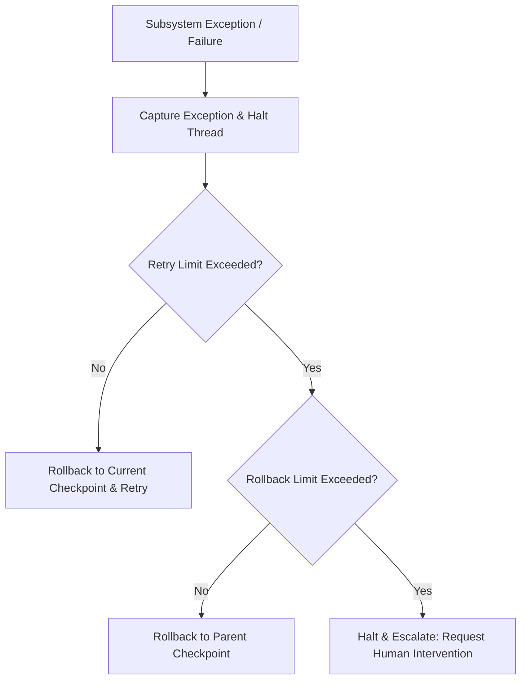

# Integration Validation Strategy - Phase 9A

This document outlines the validation strategy for verifying the end-to-end integration and details the failure recovery and rollback models.

## 1. Failure Recovery Flow Sequence

When a subsystem encounters an execution error or budget depletion, the recovery sequence executes:

1. **Failure Capture:** The active engine intercepts the exception and suspends the execution thread.
2. **Retrieve Latest Checkpoint:** The supervisor retrieves the last valid checkpoint matching the `trace_id` / `replay_id` from Working/Episodic memory.
3. **Trigger Retry:** If the retry count is under the policy limit, the engine rolls back the active state to the checkpoint and retries the iteration.
4. **Trigger Rollback:** If retries are exhausted or a hard error is encountered, the supervisor rolls back the state to the parent checkpoint.
5. **Escalate to Human:** If rollback fails or cannot resolve the conflict, the supervisor halts execution and signals the `AgentOrchestrator` to raise a human-in-the-loop review request.

### Failure Recovery Flow Diagram

---

## 2. Integration Verification Strategy

The end-to-end integration of the five subsystems will be validated using four testing tiers:

### A. Core equivalence validation
* **Goal:** Verify that mathematical operations in the Deterministic Core return equivalent results across all calling subsystems up to float precision boundaries ($10^{-12}$).
* **Execution:** Run validation scripts checking Shannon chaos, matrix inverses, and aura calibrations via loop engine calls.

### B. Registry and lifecycle validation
* **Goal:** Verify that all registries (agents, loops, memories, and vaults) freeze after startup and block runtime modifications.
* **Execution:** Attempt to register custom components post-startup, asserting that correct frozen-registry exceptions are raised.

### C. Supervised Sync and Promotion validation
* **Goal:** Verify that memory writes and vault syncs are strictly blocked without human approval, and that automatic merges are disallowed.
* **Execution:** Inject automatic merge configurations and unapproved proposals, verifying that the supervisor rejects them and raises appropriate exceptions.

### D. Replay and Rehydration verification
* **Goal:** Verify that any execution session can be replayed and rehydrated byte-for-byte using the append-only logs.
* **Execution:** Run deterministic test loops, extract the audit log trails, rehydrate mock contexts, and verify that the replayed state hash matches the original.
