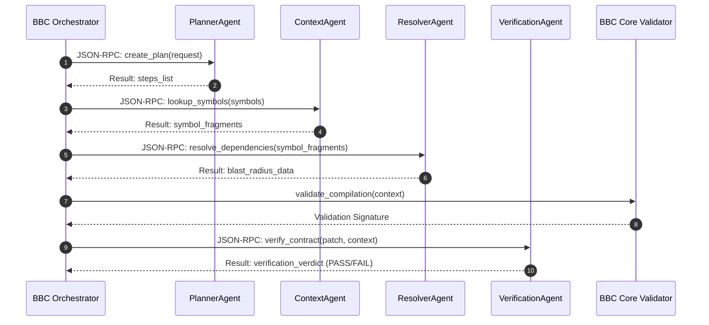
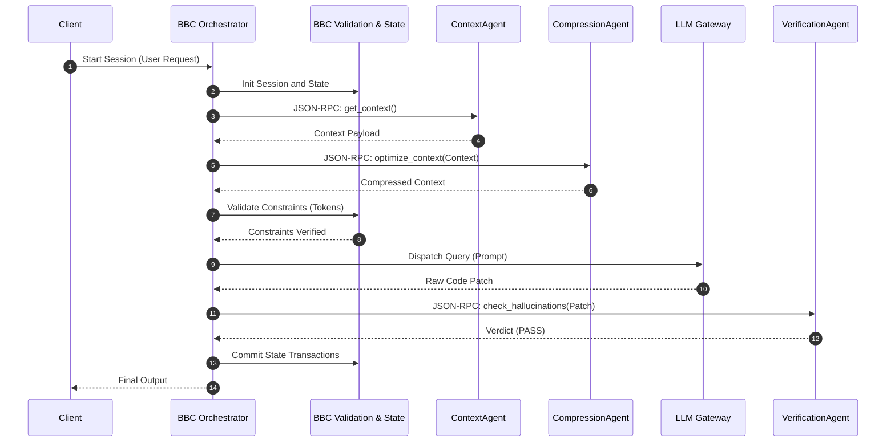
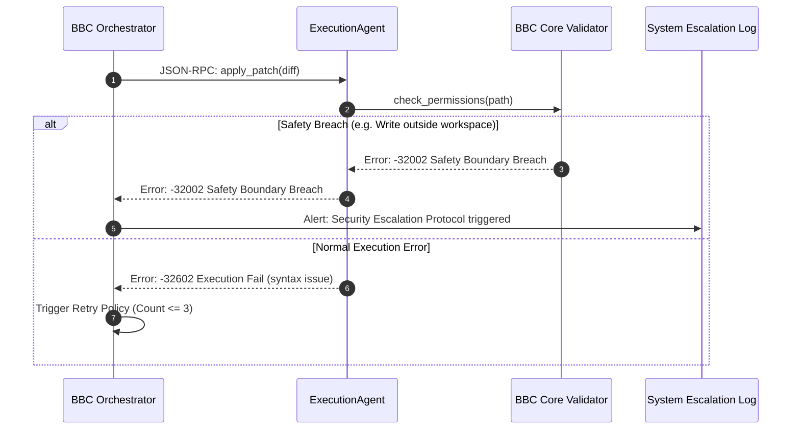

# Inter-Agent Protocol Specification - Phase 7A

This document defines the formal communication contract for inter-agent interactions within `bbc_aos`. 

All agents operate as stateless, RPC-bound execution microservices coordinating exclusively through the centralized **BBC Orchestrator**. Direct agent-to-agent communication is prohibited.

---

## 1. Protocol Standard & Schema

The communication protocol adheres strictly to the **JSON-RPC 2.0** specification, augmented with mandatory BBC validation and tracing extensions.

### A. Message Request Schema

```json
{
  "jsonrpc": "2.0",
  "id": "e0bdfde8-6bc4-47ad-8be3-9bc7785c4ad2",
  "method": "analyze_dependencies",
  "params": {
    "task_id": "8b51d3e8-5b12-4fb0-a2de-8e50bc553d0e",
    "context": {
      "symbols": ["BBCScalar"],
      "project_path": "C:/projects/my_code"
    },
    "constraints": {
      "max_token_limit": 2048,
      "strict_verification": true
    },
    "metadata": {
      "originating_agent": "PlannerAgent",
      "safety_level": "CRITICAL",
      "trace_id": "f5b89a8c-12db-4fb9-a9de-9bc0bc503bc1",
      "replay_id": "402e9a5c-5b12-4fe0-be12-9de8e50b7bca",
      "deterministic_hash": "e3b0c44298fc1c149afbf4c8996fb92427ae41e4649b934ca495991b7852b855",
      "validation_signature": "sha256-4c7b89d8ea..."
    }
  }
}
```

### B. Message Response Schema

```json
{
  "jsonrpc": "2.0",
  "id": "e0bdfde8-6bc4-47ad-8be3-9bc7785c4ad2",
  "result": {
    "status": "success",
    "data": {
      "dependencies": ["matrix_ops.py", "bbc_scalar.py"],
      "blast_radius_score": 0.125,
      "is_safe": true
    },
    "metadata": {
      "deterministic_hash": "fb89a9c1e095a5fbc400bcda789efac0e...",
      "validation_signature": "sha256-8a9d8c7..."
    }
  }
}
```

---

## 2. Mandatory BBC Metadata Extensions

To enforce auditability and determinism, all message params `metadata` dictionaries must include:
* **`trace_id`** (UUIDv4): Unique identifier mapped across all sub-agent tasks spawned from a parent request.
* **`replay_id`** (UUIDv4): Deterministic test replay identifier matching the Golden Master run.
* **`originating_agent`** (string): Name of the agent class dispatching the query request.
* **`safety_level`** (enum): Safety posture validation flag (`SANDBOX`, `STANDARD`, `CRITICAL`).
* **`deterministic_hash`** (string): SHA-256 fingerprint hash of input parameters to ensure execution idempotence.
* **`validation_signature`** (string): Signature generated by the BBC Core validation layer to certify input integrity.

---

## 3. Protocol Error Codes

In the event of an execution failure, standard JSON-RPC 2.0 error payloads are returned:

```json
{
  "jsonrpc": "2.0",
  "id": "e0bdfde8-6bc4-47ad-8be3-9bc7785c4ad2",
  "error": {
    "code": -32002,
    "message": "Safety Boundary Breach",
    "data": {
      "reason": "Forbidden file write attempted outside sandbox root directory.",
      "path": "/etc/shadow"
    }
  }
}
```

| Code | Type | Description |
| :--- | :--- | :--- |
| **`-32600`** | Invalid Request | Message structure violates schema standards. |
| **`-32601`** | Method Not Found | Requested agent action does not exist on the allowlist. |
| **`-32602`** | Invalid Params | Arguments do not match target schemas. |
| **`-32001`** | Signature Verification Failure | Validation signature does not match deterministic inputs. |
| **`-32002`** | Safety Boundary Breach | Action violates safety configurations (e.g. invalid filesystem access). |
| **`-32003`** | State Persist Failure | StateManager database or disk operation failed. |

---

## 4. Sequence Diagrams

### A. Planner → Context → Resolver → Verification Flow



### B. Multi-Agent Orchestration Flow



### C. Failure Escalation Workflow


