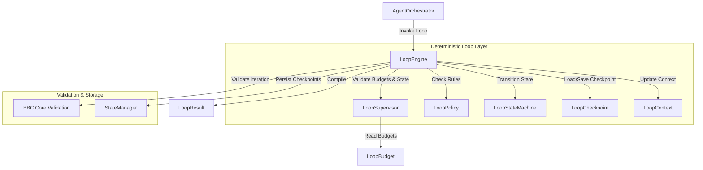

# Loop Engine Architecture Specification - Phase 7C

This document details the architectural design and structural relationships of the deterministic Loop Engine of `bbc_aos`.

## 1. System Integration Boundaries

The Loop Engine is integrated under strict caller and depth constraints:
1. **Orchestrator Dispatch Gatekeeping:** The `LoopEngine` is the only component permitted to coordinate code execution loops. It may only be invoked directly by `AgentOrchestrator`.
2. **No Self-Invocation:** The `LoopEngine` is static and cannot instantiate or call itself.
3. **Flat Execution (No Nesting):** Nested execution loops are forbidden. The loop depth limit is strictly capped at:
   $$\text{MAX\_LOOP\_DEPTH} = 1$$
4. **Finite Boundaries:** Infinite execution runs are prevented. Loop iterations are strictly capped at:
   $$\text{MAX\_ITERATIONS} = 5$$

---

## 2. Component Diagram

---

## 3. Core Component Roles

* **`LoopEngine`:** Coordinates iterations, dispatches agent steps, transitions execution states, and captures checkpoints.
* **`LoopSupervisor`:** Continuously checks runtime bounds (e.g. safety, token consumption, and execution time limits).
* **`LoopContext`:** Immutable data model tracking the loop parameters, task identifiers, and iteration indexes.
* **`LoopCheckpoint`:** Captures state snapshots to allow safe rollback and deterministic execution replay.
* **`LoopResult`:** Packs final output results or error logs into a JSON-RPC response.
* **`LoopPolicy`:** Defines retry limits, escalation thresholds, rollback thresholds, and human approval requirements.
* **`LoopBudget`:** Defines and tracks token, execution time, iteration count, and safety sandbox budgets.
* **`LoopStateMachine`:** Manages deterministic transitions between execution states (`CREATED`, `READY`, `RUNNING`, `WAITING_APPROVAL`, `RETRYING`, `COMPLETED`, `FAILED`, `TERMINATED`).
