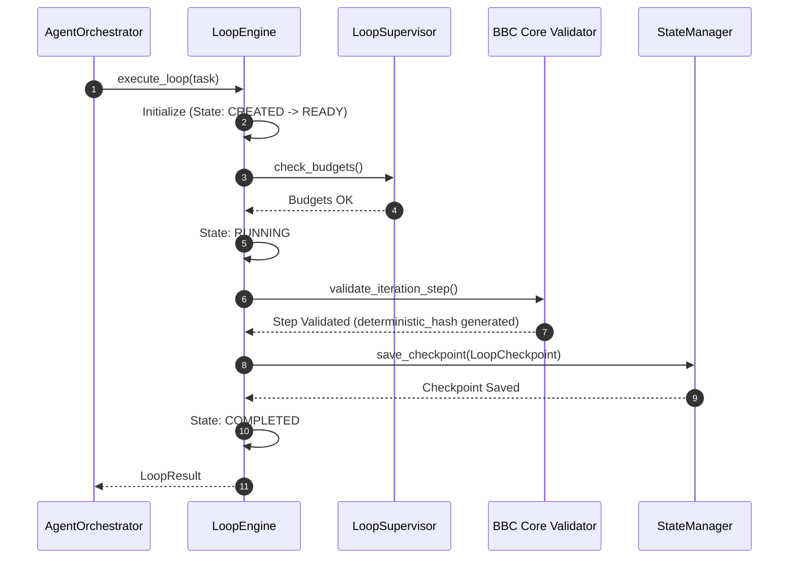
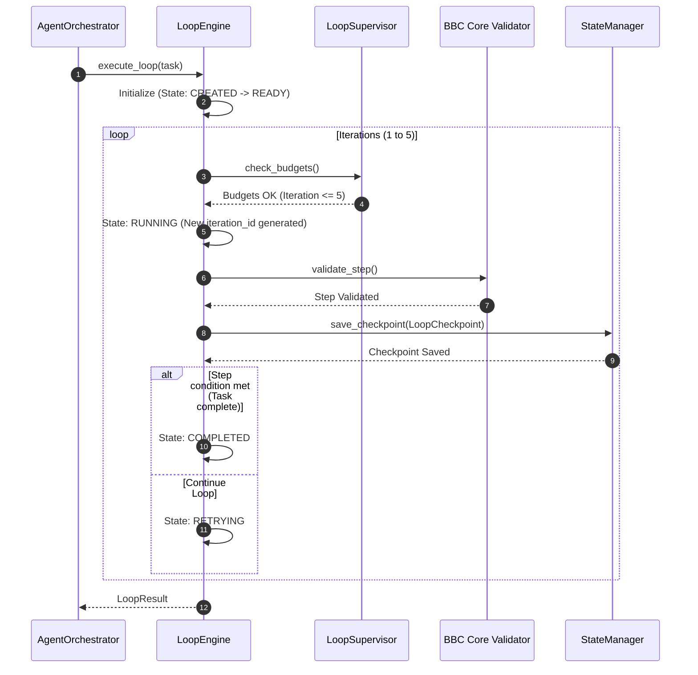

# Loop Execution Model Specification - Phase 7C

This document details the deterministic loop execution lifecycle, checkpointing mechanisms, and workflow sequences in `bbc_aos`.

---

## 1. Deterministic Execution Parameters

Every execution loop must be fully traceable, repeatable, and audited. Each iteration generates the following tracking parameters:
* **`trace_id`** (UUIDv4): Unique identifier tracking the parent request context.
* **`replay_id`** (UUIDv4): Tracing identifier matching Golden Master tests.
* **`iteration_id`** (UUIDv4): Unique identifier generated for the specific loop iteration step.
* **`deterministic_hash`** (SHA-256): Hash fingerprint of inputs and state variables to guarantee repeatability.

---

## 2. Checkpointing and State Persistence

To ensure loops can be replayed and resumed:
1. **Mandatory Iteration Checkpoint:** The `LoopEngine` must capture and save a `LoopCheckpoint` through the `StateManager` at the end of *every* iteration.
2. **Replayability:** A checkpoint must contain all the state required (memory logs, variables, last code AST) to rebuild and resume the loop from that specific step without behavioral drift.

---

## 3. Execution Sequence Diagrams

### A. Single-Step Deterministic Loop Execution

### B. Multi-Step Deterministic Loop Execution

