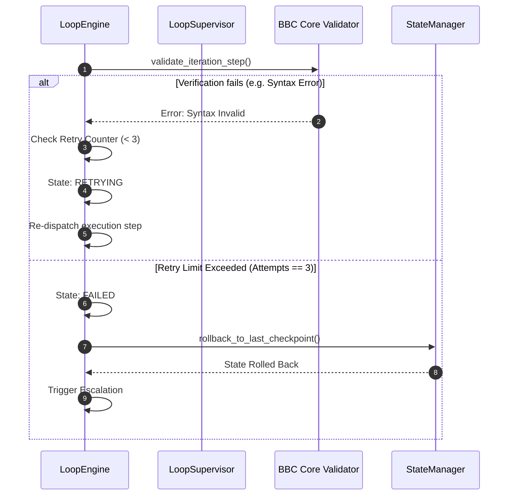
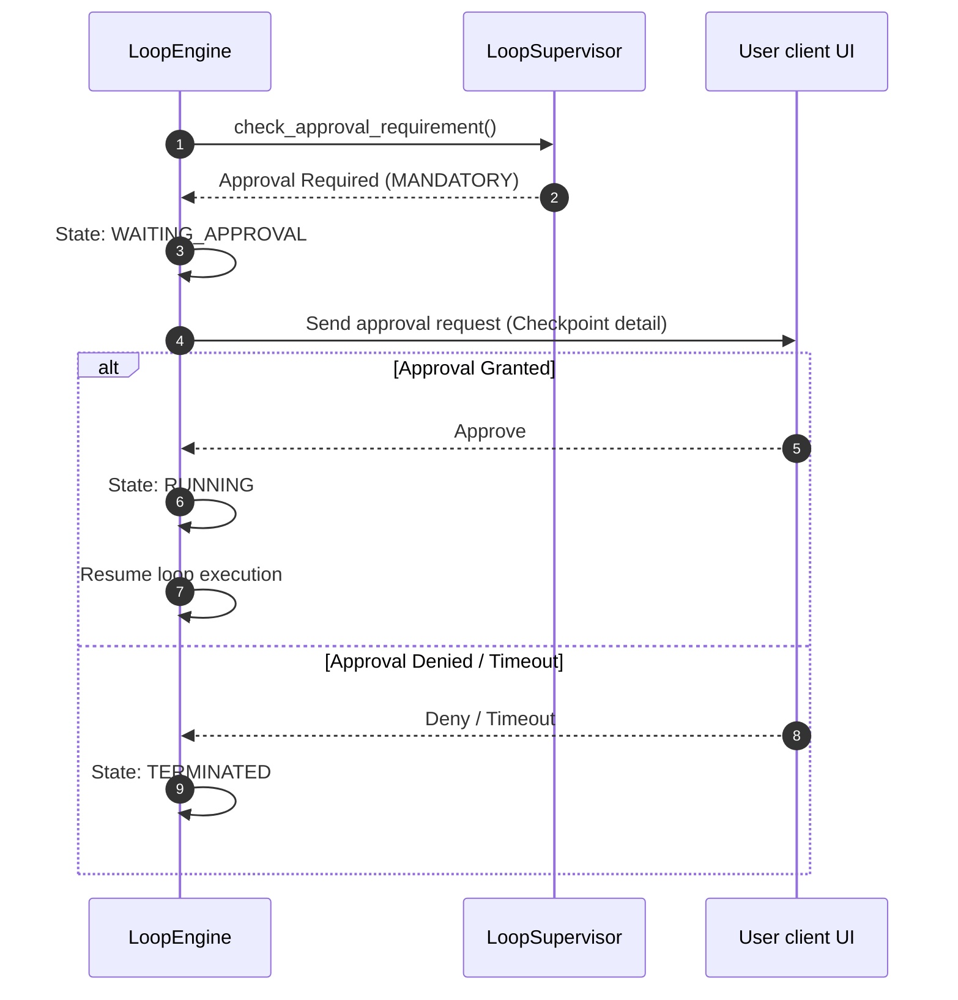
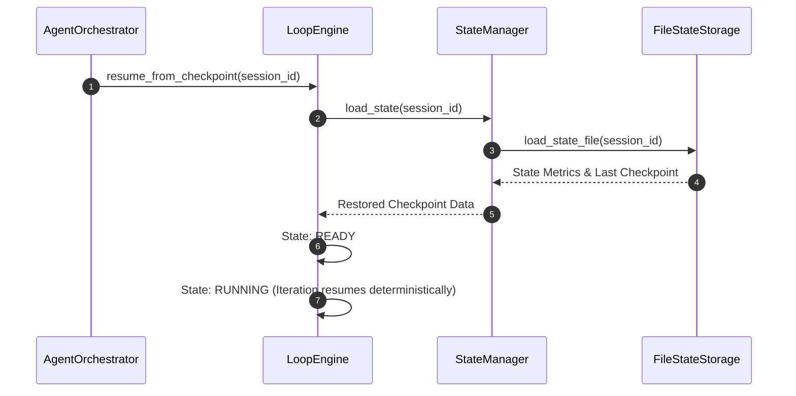

# Loop Failure Recovery Specification - Phase 7C

This document establishes the error recovery policies, rollback procedures, and escalation workflows for the Loop Engine of `bbc_aos`.

---

## 1. Failure Recovery Actions

When an error is detected during loop execution, the `LoopEngine` dispatches one of the following recovery actions:

```
[Error Detected] ──> [Is Transient?] ────> Yes ──> [Retry Iteration]
                     └──> No ──> [Rollback State] ──> [Escalate / Terminate]
```

* **`Retry`:** Re-dispatches the iteration step with adjusted parameters (e.g., modified context prompts). Only allowed for transient syntax or parsing issues.
* **`Rollback`:** Restores the system state, files, and index databases to the last validated `LoopCheckpoint`.
* **`Escalate`:** Halts execution, raises an RPC error code, logs details to the system, and prompts for manual intervention.
* **`Terminate`:** Forcefully aborts loop execution, transitions the state machine to `TERMINATED`, and cleans up all uncommitted temporary transaction states.

---

## 2. LoopPolicy Definitions

The `LoopPolicy` defines the boundaries, conditions, and requirements governing loop state recovery:

* **Retry Limits:**
  * Capped at a maximum of 3 retry attempts per iteration.
  * Triggered by transient syntax errors, parsing issues, or JSON-RPC schema validation failures.
* **Escalation Thresholds:**
  * Triggers when the iteration retry limit is exhausted (attempts == 3).
  * Triggers when any safety budget check is breached (e.g., attempt to write outside sandbox).
  * Triggers when the state persistence engine encounters unrecoverable corruption.
* **Rollback Thresholds:**
  * Triggers immediately on any syntax check failure or verification failure that cannot be healed in place.
  * Reverts the project workspace files to the exact git and state checkpoint recorded at the start of the current iteration.
* **Approval Requirements:**
  * Defines human approval requirements for execution steps. Supports three gate options:
    1. *Mandatory approval:* Execution pauses indefinitely until user explicitly approves.
    2. *Optional approval:* Prompts the user but auto-proceeds if no response occurs within a limit.
    3. *Timeout approval:* Pauses and auto-terminates/fails the execution if the user does not respond within a configurable timeout duration (default: 5 minutes).

---

## 3. Workflow Diagrams

### A. Failure Recovery Workflow



### B. Human Approval Workflow



### C. Checkpoint Recovery Workflow


