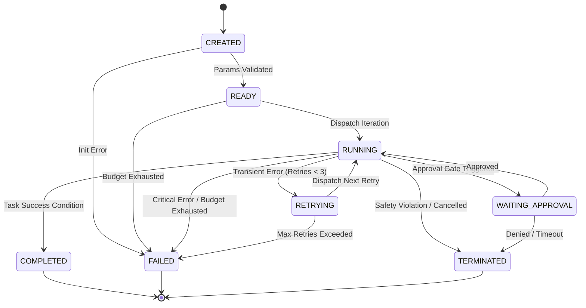

# Loop State Machine Specification - Phase 7C

This document defines the lifecycle states and transition rules of the deterministic Loop Engine state machine.

---

## 1. Lifecycle States

The loop execution lifecycle is governed by a strict state machine:

| State | Description | Allowed Next States |
| :--- | :--- | :--- |
| **`CREATED`** | Loop is initialized with a `LoopContext`. | `READY`, `FAILED` |
| **`READY`** | Parameter schemas are validated and budgets are checked. | `RUNNING`, `FAILED` |
| **`RUNNING`** | Iteration step is executing and validating outputs. | `WAITING_APPROVAL`, `RETRYING`, `COMPLETED`, `FAILED`, `TERMINATED` |
| **`WAITING_APPROVAL`** | Loop is paused waiting for user confirmation. | `RUNNING`, `TERMINATED` |
| **`RETRYING`** | Step failed minor syntax/schema check and is preparing retry. | `RUNNING`, `FAILED` |
| **`COMPLETED`** | Loop executed successfully and returned results. | `[*]` (Exit) |
| **`FAILED`** | Iterations or budgets are exhausted. | `[*]` (Exit) |
| **`TERMINATED`** | Loop was explicitly cancelled by safety limits or user. | `[*]` (Exit) |

---

## 2. Transition Rules

* **`CREATED → READY`:** Triggered when the orchestrator dispatches a loop execution message, and parameter context schemas are verified.
* **`READY → RUNNING`:** Triggered when the supervisor validates budget status and dispatches the first iteration.
* **`RUNNING → WAITING_APPROVAL`:** Triggered when hitting a designated checkpoint requiring human confirmation.
* **`RUNNING → RETRYING`:** Triggered when a syntax validation fails but remaining retries are available.
* **`RUNNING → COMPLETED`:** Triggered when all tasks in the context are completed successfully.
* **`RUNNING → FAILED`:** Triggered when iterations exceed 5 or a critical execution exception is encountered.
* **`RUNNING → TERMINATED`:** Triggered when a directory safety sandbox violation is detected.
