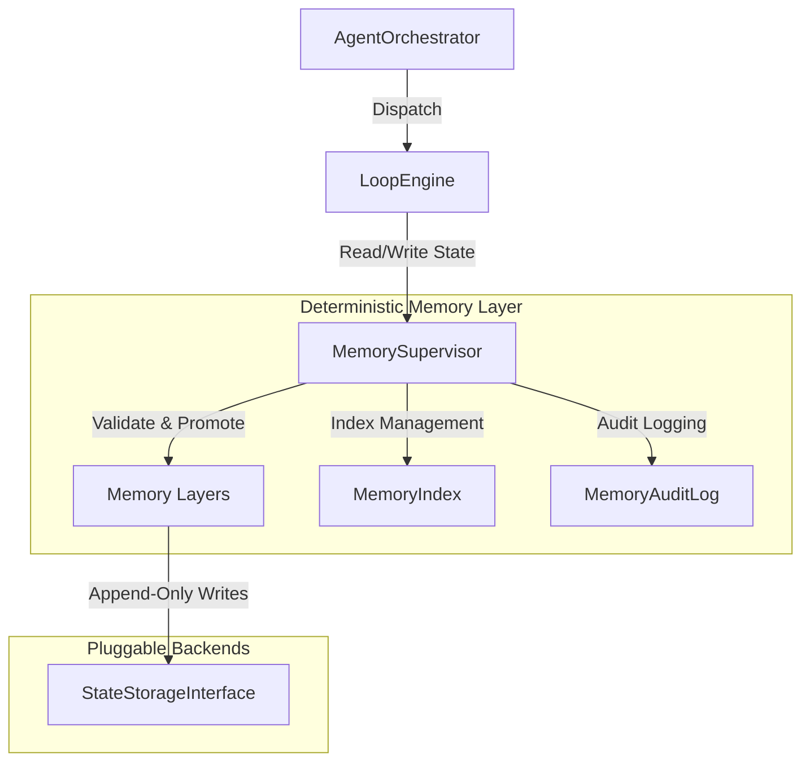

# Memory Architecture V2 - Phase 7E

This document details the overall design, structural relationships, and system integration boundaries of the `bbc_aos` Memory Layer.

## 1. System Integration Boundaries

The Memory Layer sits underneath the Agent Orchestrator and the Loop Engine, acting as the deterministic, auditable data store for execution state, history, recipes, and experience traces.

---

## 2. Core Components and Abstractions

* **`MemorySupervisor`:** The central controller responsible for:
  * Enforcing retention policies across all memory layers.
  * Validating cross-layer promotion operations.
  * Detecting conflicts and applying resolution rules.
  * Managing lifecycle transitions of memory records.
  * Generating immutable audit trails.
* **`MemoryIndex`:** Abstraction defining how memory records are indexed (e.g., hash indexes, hierarchical symbol graphs, SimHash indexes). Ensures fast, deterministic, and O(1) or O(log N) lookup.
* **`MemoryAuditLog`:** System-wide audit recorder that appends an immutable audit event for every single memory read, write, or promotion operation.

---

## 3. General Design Guidelines

To guarantee mathematical determinism and prevent state corruption, the memory subsystem operates under strict rules:
1. **Append-Only Writes:** Memory records are strictly append-only. Modifying existing bytes or records in-place is forbidden.
2. **Immutability:** Once written to disk, memory records are read-only and immutable.
3. **Strict Versioning:** Every write contains an incremental version number. Concurrent updates generate a new version node rather than modifying the current one.
4. **Isolations:**
   * **Human Knowledge Isolation:** Human Knowledge Memory (Obsidian notes, wiki pages) must remain completely isolated from system memory to prevent unverified prompt injections or hallucinations.
   * **Experience Memory Isolation:** Experience Memory (workflows, traces) can only reference Semantic Memory; it is prohibited from directly modifying semantic recipes.
5. **Deterministic Retrieval:** Lookups must be deterministic, repeatable, and replayable from recording logs.
