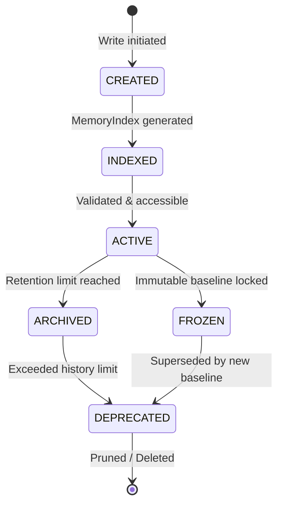
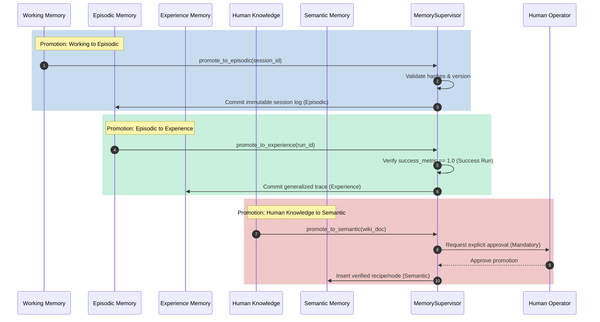

# Memory Lifecycle Specification - Phase 7E

This document details the lifecycle states, retention and compaction policies, conflict resolution rules, and promotion workflows for all memory records.

---

## 1. Memory Lifecycle States

A memory record transitions through the following deterministic states:

* **`CREATED`:** Memory record initialized but not yet indexed or audited.
* **`INDEXED`:** Metadata and search pointers compiled.
* **`ACTIVE`:** Readily queries by agent pipelines.
* **`ARCHIVED`:** Moved to long-term storage due to age or inactivity.
* **`FROZEN`:** Locked, immutable baseline context (e.g. frozen recipes).
* **`DEPRECATED`:** Superseded by a newer version or marked out of scope.

---

## 2. Retention Policies by Layer

To prevent memory bloat, `MemorySupervisor` enforces the following retention limits:

* **Working Memory:** Retained only for the active session. Automatically pruned when session transitions to `COMPLETED` or `FAILED`.
* **Episodic Memory:** Retained for 90 days or up to 500 completed execution runs. Older episodes are compressed and transitioned to `ARCHIVED`.
* **Semantic Memory:** Retained indefinitely. System-wide configuration recipes and graphs do not expire.
* **Human Knowledge Memory:** Retained indefinitely. Hand-written guides and documentation are kept until explicitly deprecated by a human operator.
* **Experience Memory:** Retained for 180 days. Traces that are not replayed or referenced within this period are transitioned to `ARCHIVED`.

---

## 3. Compaction Policies by Layer

To conserve disk space and maintain search efficiency, the supervisor runs compaction routines:

* **Working Memory:** No compaction. Full session data is cleared upon termination.
* **Episodic Memory:** Weekly compaction. Combines sequential step details into unified transaction logs, discarding debug execution traces while preserving final inputs, outputs, and diff hashes.
* **Semantic Memory:** Graph compaction occurs on code structure changes. Prunes detached dependency branches and collapses redundant paths.
* **Human Knowledge Memory:** No compaction. Maintained as standard user markdown files.
* **Experience Memory:** Monthly consolidation. Merges structurally identical trace blueprints, averaging performance metrics to create consolidated experience nodes.

---

## 4. Conflict Resolution Policies

When duplicate or conflicting records (e.g., matching indexes with different data structures) are detected:

1. **Version Dominance:** The record with the higher incremental version value is selected by default.
2. **Deterministic Hash Verification:** If versions match but hashes differ, the supervisor halts retrieval and raises a compaction/indexing collision alert.
3. **Manual Override:** For conflicts on Semantic Memory (BBC recipes), execution is paused, transitioning the loop to `WAITING_APPROVAL` for human resolution.

---

## 5. Cross-Layer Promotion Workflows

Memory promotion transitions data across layers to build long-term systems knowledge.

