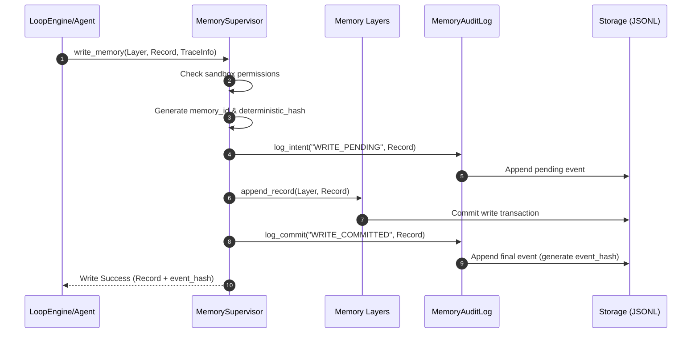

# Memory Observability Contracts - Phase 7E

This document details the telemetry logs, structured schemas, and playback contracts designed to audit every memory transaction in `bbc_aos`.

---

## 1. Tracing Metadata Block

Every memory record and query contains the following immutable metadata block:

```json
{
  "memory_id": "mem_001a2b3c4d5e",
  "trace_id": "893c5c99-0d1a-4d92-a1de-50cbfa192be4",
  "replay_id": "402e9a5c-5b12-4fe0-be12-9de8e50b7bca",
  "deterministic_hash": "e3b0c44298fc1c149afbf4c8996fb92427ae41e4649b934ca495991b7852b855",
  "version": 1,
  "created_at": "2026-06-24T18:05:00Z",
  "originating_agent": "planner_agent"
}
```

---

## 2. Memory Audit Log Schema

Read, write, and promotion operations generate an entry in the system-wide audit logs (`.bbc/logs/memory_audit.jsonl`). Each audit event is immutable:

```json
{
  "timestamp": "2026-06-24T18:06:10.123Z",
  "operation": "WRITE",
  "layer": "episodic",
  "memory_id": "mem_001a2b3c4d5e",
  "trace_id": "893c5c99-0d1a-4d92-a1de-50cbfa192be4",
  "replay_id": "402e9a5c-5b12-4fe0-be12-9de8e50b7bca",
  "deterministic_hash": "e3b0c44298fc1c149afbf4c8996fb92427ae41e4649b934ca495991b7852b855",
  "actor": "loop_engine",
  "event_hash": "cf4f5f6a7b8c9d0e1f2a...",
  "status": "committed"
}
```

---

## 3. Memory Audit Workflow

The audit sequence is tightly coupled with database transactions to ensure that un-audited state changes are impossible.


