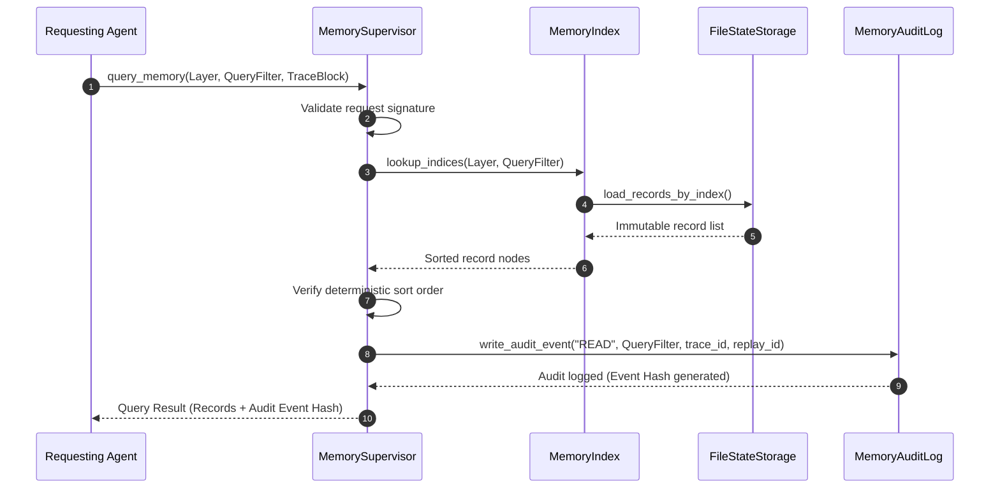

# Memory Retrieval Contracts - Phase 7E

This document defines the deterministic API schema, parameters, and workflows for querying memory records in `bbc_aos`.

---

## 1. Retrieval Query Contract

Every query sent to the memory subsystem must specify strict search parameters to guarantee repeatable results:

```json
{
  "jsonrpc": "2.0",
  "method": "memory.query",
  "params": {
    "layer": "episodic",
    "query_filter": {
      "task_id": "f8a002bc-3a1d-4eb2-8cde-8e50bc55a022",
      "version": 1
    },
    "max_results": 10,
    "deterministic_sort": "created_at_asc",
    "metadata": {
      "trace_id": "893c5c99-0d1a-4d92-a1de-50cbfa192be4",
      "replay_id": "402e9a5c-5b12-4fe0-be12-9de8e50b7bca"
    }
  },
  "id": "req_val_001"
}
```

* **`layer`:** Target layer (`working`, `episodic`, `semantic`, `human_knowledge`, `experience`).
* **`deterministic_sort`:** Sorting parameter to ensure returned record orders are identical across replay runs.
* **`trace_id`/`replay_id`:** Propagation tracking ids.

---

## 2. Retrieval Response Contract

The returned data structure guarantees absolute repeatability:

```json
{
  "jsonrpc": "2.0",
  "result": {
    "records": [
      {
        "memory_id": "mem_rec_1002",
        "trace_id": "893c5c99-0d1a-4d92-a1de-50cbfa192be4",
        "replay_id": "402e9a5c-5b12-4fe0-be12-9de8e50b7bca",
        "deterministic_hash": "e3b0c44298fc1c149afbf4c8996fb92427ae41e4649b934ca495991b7852b855",
        "version": 1,
        "created_at": "2026-06-24T18:05:00Z",
        "originating_agent": "planner_agent",
        "data": {
          "status": "completed",
          "steps_executed": 3
        }
      }
    ],
    "audit_hash": "55f5f6d7e8b8c9d0a1b2..."
  },
  "id": "req_val_001"
}
```

---

## 3. Retrieval Workflow Diagram


