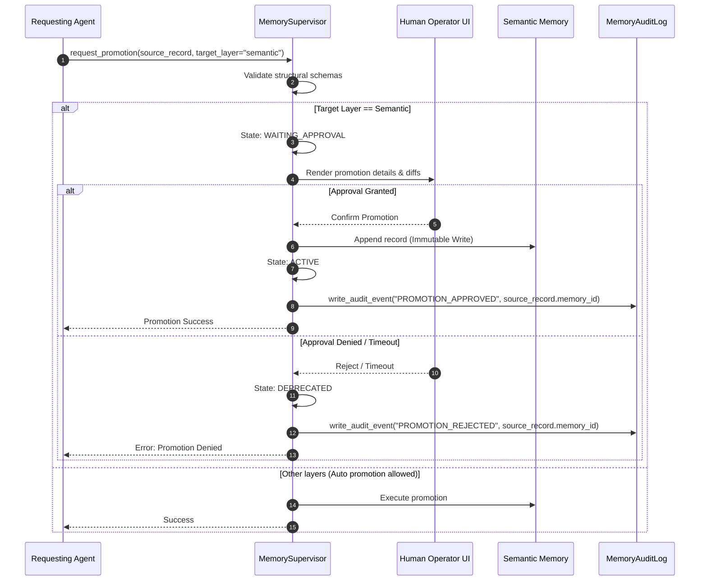

# Memory Safety Constraints - Phase 7E

This document details the safety rules, sandboxing boundaries, isolation policies, and verification steps applied to the Memory Layer of `bbc_aos`.

---

## 1. Safety Isolation Constraints

* **Human Knowledge Isolation:**
  * **Rule:** Human Knowledge Memory (Obsidian, wiki pages) must remain completely isolated from system working and semantic memories.
  * **Implementation:** The filesystem directories (`.obsidian/`, `wiki/`) are read-only to all executing agents. No agent, orchestrator, or loop engine component may execute write actions to these paths.
  * **Reason:** Prevents untrusted user input from modifying system specifications or injecting commands into prompt builders without supervisor audit.
* **Experience Memory Modification Limits:**
  * **Rule:** Experience Memory can only read and reference Semantic Memory nodes (recipes, graphs).
  * **Implementation:** Experience Memory cannot write to, modify, or insert nodes into Semantic Memory. 
  * **Reason:** Ensures execution optimizations do not alter the deterministic equivalence guarantees of verified code recipes.

---

## 2. Memory Visibility Scopes

Memory visibility is strictly bound to agent roles:

| Memory Layer | Read Visibility | Write Visibility |
| :--- | :--- | :--- |
| **Working Memory** | Orchestrator, LoopEngine, Active Agents | LoopEngine, StateManager |
| **Episodic Memory** | Orchestrator, VerificationAgent | MemorySupervisor |
| **Semantic Memory** | All Agents, Orchestrator | MemorySupervisor (Human approved only) |
| **Human Knowledge** | All Agents, Orchestrator | Human Operators Only (System Read-Only) |
| **Experience Memory**| PlannerAgent, ContextAgent | MemorySupervisor |

---

## 3. Human Approval promotion workflow

Cross-layer promotions (e.g. promoting a proposed human document or wiki page into a semantic recipe node) requires mandatory, explicit human operator confirmation.

