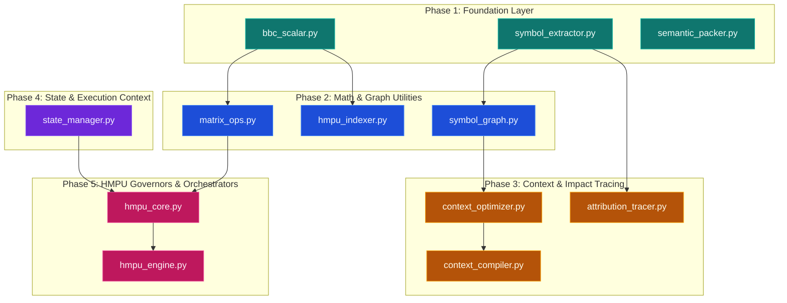

# Migration Sequence - BBC-AOS Deterministic Layer

This document outlines the step-by-step migration sequence for the deterministic core components, structured to ensure that no component is migrated before its dependencies are resolved.

---

## 1. Migration Sequence Overview

The migration is divided into 5 distinct phases based on the dependency tree of the legacy codebase:

---

## 2. Phase-by-Phase Execution Plan

### Phase 1: Foundation Layer
No dependencies. These components form the building blocks for downstream calculations.

1. **Step 1: `bbc_scalar.py`**
   * *Target Path:* [validation_models.py](file:///C:/Users/90535/Desktop/BBC_AOS_Wiki/bbc_aos/models/validation_models.py)
   * *Verification:* Run unit tests verifying state promotion tables and arithmetic.
2. **Step 2: `symbol_extractor.py`**
   * *Target Path:* [repository_scanner.py](file:///C:/Users/90535/Desktop/BBC_AOS_Wiki/bbc_aos/tools/repository_scanner.py)
   * *Verification:* Scan a sample python file and verify extracted AST dict matches legacy output structure.
3. **Step 3: `semantic_packer.py`**
   * *Target Path:* [memory_tools.py](file:///C:/Users/90535/Desktop/BBC_AOS_Wiki/bbc_aos/tools/memory_tools.py)
   * *Verification:* Verify context compression savings metrics.

### Phase 2: Math & Graph Utilities
Depends on Phase 1 components.

4. **Step 4: `matrix_ops.py`**
   * *Target Path:* [constraints_engine.py](file:///C:/Users/90535/Desktop/BBC_AOS_Wiki/bbc_aos/core/constraints_engine.py) (Internal helpers)
   * *Verification:* Check $3\times3$ matrix inversions and condition number outputs using `BBCScalar`.
5. **Step 5: `symbol_graph.py`**
   * *Target Path:* [graph_tools.py](file:///C:/Users/90535/Desktop/BBC_AOS_Wiki/bbc_aos/tools/graph_tools.py)
   * *Verification:* Parse and verify internal/external caller metrics on a test workspace.
6. **Step 6: `hmpu_indexer.py`**
   * *Target Path:* [knowledge_store.py](file:///C:/Users/90535/Desktop/BBC_AOS_Wiki/bbc_aos/core/knowledge_store.py)
   * *Verification:* Test 128-bit SimHash, Hamming distances, and hybrid memory queries (60/40 score).

### Phase 3: Context & Impact Tracing
Depends on Phase 2 components.

7. **Step 7: `context_optimizer.py`**
   * *Target Path:* [context_reducer.py](file:///C:/Users/90535/Desktop/BBC_AOS_Wiki/bbc_aos/core/context_reducer.py)
   * *Verification:* Feed a symbol graph and verify blast radius score divisions.
8. **Step 8: `context_compiler.py`**
   * *Target Path:* [context_builder.py](file:///C:/Users/90535/Desktop/BBC_AOS_Wiki/bbc_aos/core/context_builder.py)
   * *Verification:* Compile profiles (`bugfix`, `feature`) and match formatting contracts.
9. **Step 9: `attribution_tracer.py`**
   * *Target Path:* [tracing.py](file:///C:/Users/90535/Desktop/BBC_AOS_Wiki/bbc_aos/observability/tracing.py)
   * *Verification:* Verify cross-file reference scan and blast radius logs.

### Phase 4: State & Execution Context
Integrates telemetry/budget control logic.

10. **Step 10: `state_manager.py`**
    * *Target Path:* [execution_context.py](file:///C:/Users/90535/Desktop/BBC_AOS_Wiki/bbc_aos/core/execution_context.py)
    * *Verification:* Test token accumulation limits and session/global budget decrements.

### Phase 5: HMPU Governors & Orchestrators
Depends on all math and state managers.

11. **Step 11: `hmpu_core.py`**
    * *Target Path:* [constraints_engine.py](file:///C:/Users/90535/Desktop/BBC_AOS_Wiki/bbc_aos/core/constraints_engine.py)
    * *Verification:* Confirm the four core operator formulas ($dC/dt$, $\nabla A$, $P_{t+1}$, $F_{\perp}$) and self-healing budget triggers.
12. **Step 12: `hmpu_engine.py`**
    * *Target Path:* [orchestrator.py](file:///C:/Users/90535/Desktop/BBC_AOS_Wiki/bbc_aos/core/orchestrator.py)
    * *Verification:* Run multi-recipe validation runs using whitelists and verify Constraint Violation Protocol (CVP) trigger responses.
