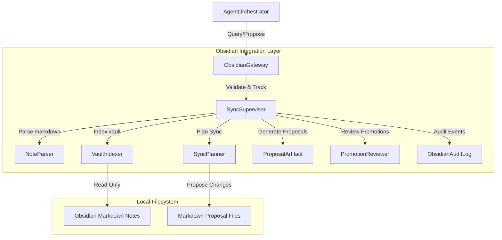

# Obsidian Integration Architecture - Phase 7F

This document establishes the architecture design, integration topology, and component contracts for the Human Knowledge Layer and local-first Obsidian vault integration in `bbc_aos`.

## 1. System Integration Boundaries

The Obsidian vault is the primary human-readable knowledge store. It is local-first, user-controlled, and strictly isolated from automatic, un-audited system updates.

---

## 2. Core Components and Abstractions

* **`ObsidianGateway`:** Exposes the JSON-RPC interface to the orchestrator for reading vault notes and submitting change proposals.
* **`VaultIndexer`:** Scans the local vault directory to generate index matrices and symbol tables without modifying file content.
* **`NoteParser`:** Parses note headers, YAML frontmatter boundaries, and markdown bodies.
* **`SyncPlanner`:** Compiles differences between memory state and note states, and generates change recommendations.
* **`PromotionReviewer`:** Coordinates human validations for promoting Obsidian notes into Semantic Memory.
* **`ObsidianAuditLog`:** An append-only log file recording every synchronization event.
* **`ProposalArtifact`:** Abstraction holding a recommended note update. It contains:
  * `proposed_change`: The markdown diff text block.
  * `rationale`: Explanation for the proposed change.
  * `originating_trace`: Tracing block identifiers.
  * `safety_assessment`: Security assessment confirming no AST or constraint violations.
* **`SyncSupervisor`:** The daemon coordinator responsible for:
  * Validating proposed modifications.
  * Merging notes under explicit human approval.
  * Enforcing approval rules.
  * Generating sync audits.
  * Creating replay datasets.
