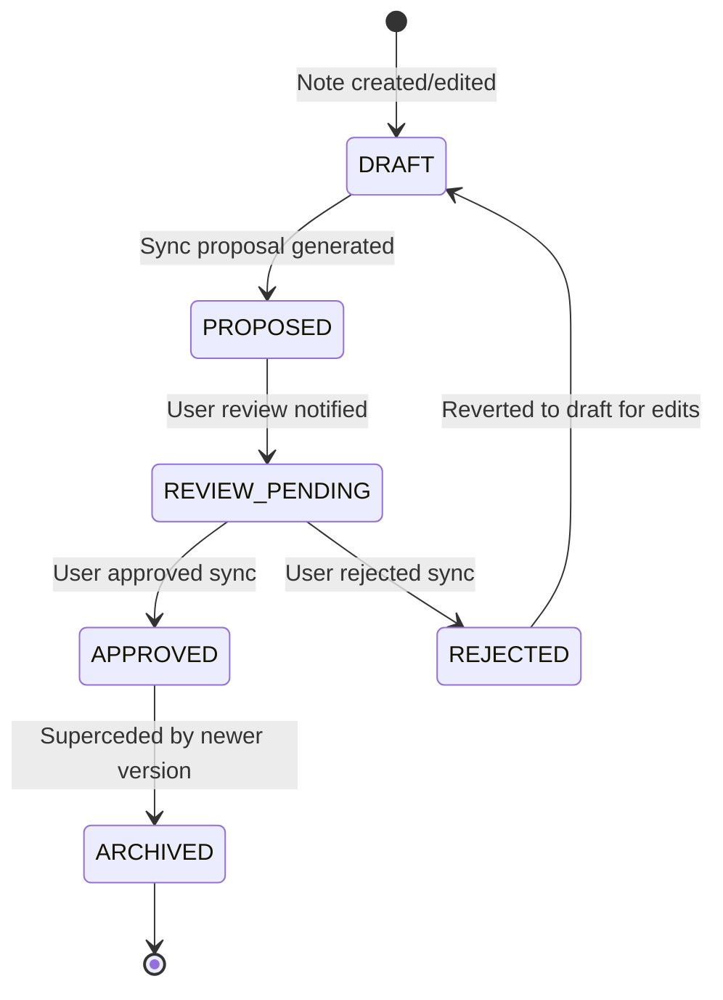
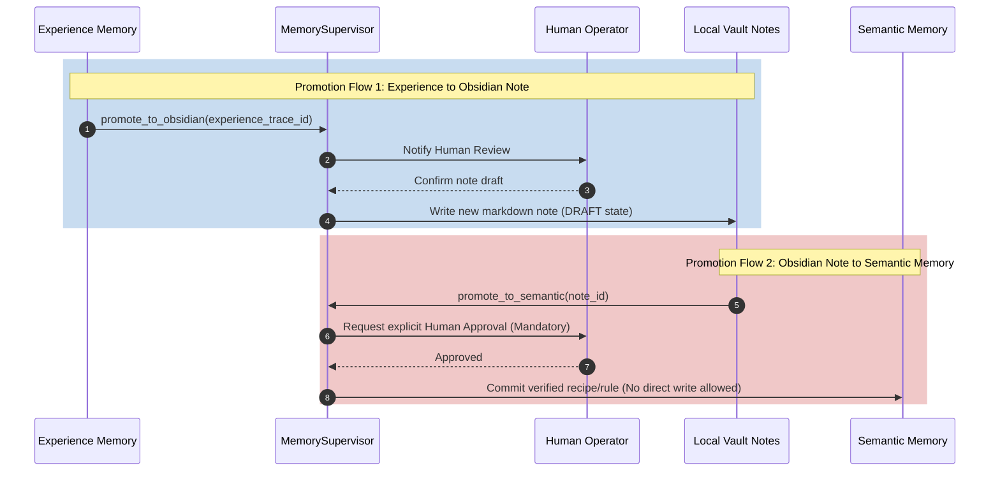
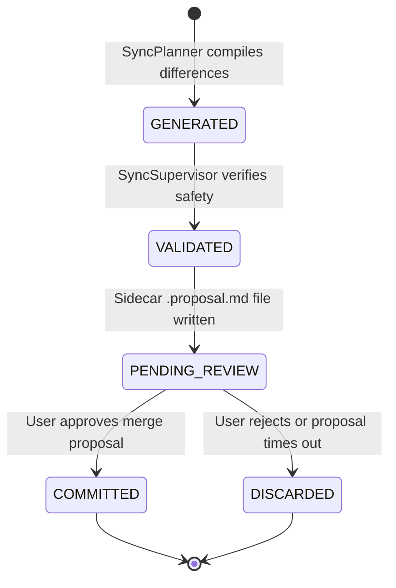

# Obsidian Memory Promotion Rules - Phase 7F

This document establishes the transition states and cross-layer promotion rules governing human notes and experience memory items.

---

## 1. Note Lifecycle States

Every note and proposal moves through the following states:

* **`DRAFT`:** Active workspace modifications.
* **`PROPOSED`:** `ProposalArtifact` written as sidecar diff.
* **`REVIEW_PENDING`:** Waiting for human operator authorization.
* **`APPROVED`:** Confirmed by operator; changes merged.
* **`REJECTED`:** Denied by operator; changes discarded.
* **`ARCHIVED`:** Replaced by newer notes or deprecated.

---

## 2. Knowledge Promotion Workflow Diagram

---

## 3. Proposal Lifecycle Workflow Diagram

The `ProposalArtifact` transitions determine how system-proposed changes are safely merged into the human vault.

