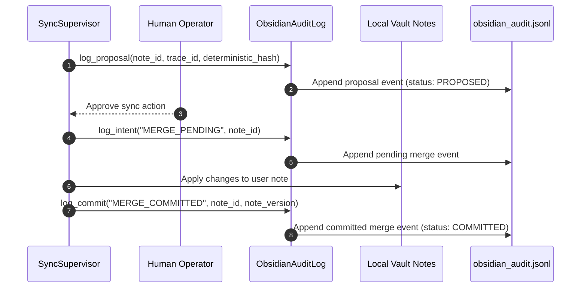

# Obsidian Observability Contracts - Phase 7F

This document specifies the telemetry log formats, audit trails, and playback tracing contracts for Obsidian vault synchronization events.

---

## 1. Synchronization Tracing Block

Every synchronization proposal and committed event must generate and record the following tracking metadata:

```json
{
  "trace_id": "e5b89a8c-12db-4fb9-a9de-9bc0bc503bc1",
  "replay_id": "402e9a5c-5b12-4fe0-be12-9de8e50b7bca",
  "deterministic_hash": "e3b0c44298fc1c149afbf4c8996fb92427ae41e4649b934ca495991b7852b855",
  "note_version": 2
}
```

---

## 2. Immutable Obsidian Audit Log Schema

Synchronization audits are recorded in the append-only `obsidian_audit.jsonl` log file:

```json
{
  "timestamp": "2026-06-24T18:12:00.123Z",
  "event": "SYNC_MERGE",
  "note_id": "doc_9bc0e5bc_12ab",
  "trace_id": "e5b89a8c-12db-4fb9-a9de-9bc0bc503bc1",
  "replay_id": "402e9a5c-5b12-4fe0-be12-9de8e50b7bca",
  "deterministic_hash": "e3b0c44298fc1c149afbf4c8996fb92427ae41e4649b934ca495991b7852b855",
  "note_version": 2,
  "operator_action": "APPROVED",
  "event_hash": "e3b0c44298fc1c149afbf4c8996fb92427ae41e4649b934ca495991b7852b855"
}
```

---

## 3. Audit Workflow Diagram

The `ObsidianAuditLog` records every read, proposal, and merge event before changes are committed, ensuring that un-audited sync actions are impossible.


