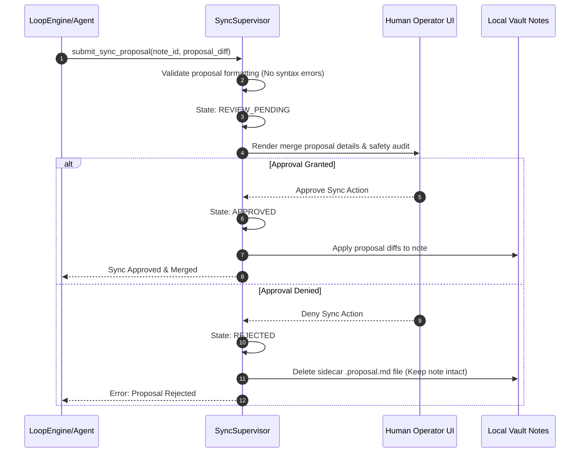

# Obsidian Safety Constraints - Phase 7F

This document establishes the safety guardrails, sandboxing rules, and isolation parameters for the human knowledge integration layer.

---

## 1. Safety Guardrails

To preserve note integrity and prevent automated system contamination:
* **Local-First Vault:** The Obsidian vault is strictly local-first and resides entirely inside the local filesystem.
* **No Direct System Writes:** The BBC system is prohibited from directly editing or writing to human-authored markdown files.
* **Proposal-Based Operations:** The system may only generate `ProposalArtifact` sidecar files (diffs). Diffs are merged into notes only after explicit operator authorization.
* **Mandatory Human Approval:** Human approval is mandatory before any synchronization or promotion takes place. Automatic note merges, overrides, or updates are strictly forbidden.
* **No Direct Semantic Memory Writes:** Reading human knowledge cannot write directly to Semantic Memory. It must trigger a promotion request, pass through human confirmation, and commit via the orchestrator validator.

---

## 2. Directory Isolation Boundaries

* **Human Files Isolation:** The `SyncSupervisor` enforces directory locks. Only files with suffix `.proposal.md` are writable by the execution environment. Original user markdown files are treated as read-only on the system permission layer.
* **Promotions Lockout:** Promoting human notes into semantic recipes is blocked during active agent runs. It can only occur during stable, orchestrator-controlled maintenance blocks.

---

## 3. Human Approval Workflow Diagram

