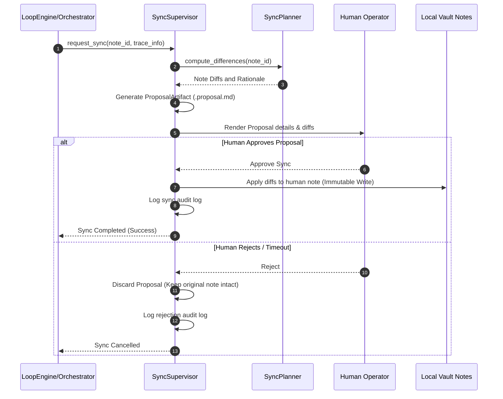
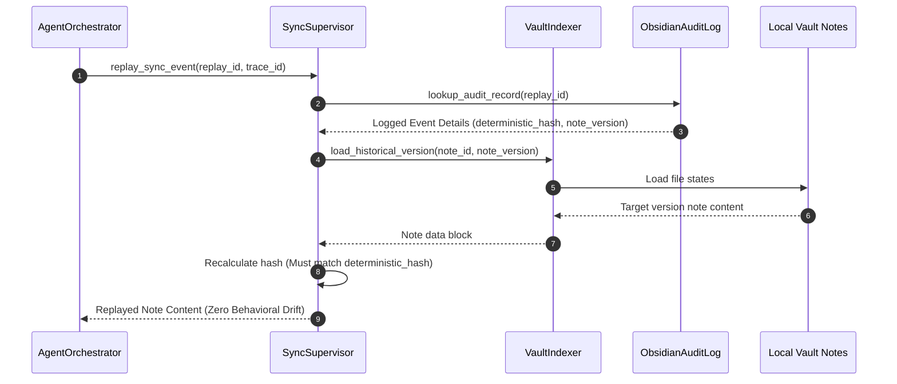

# Obsidian Synchronization Model - Phase 7F

This document specifies the synchronization policies, transition stages, and replay models designed to integrate human-edited notes deterministically.

---

## 1. Synchronization Policies

To prevent unauthorized modification of human documents, three synchronization policies are enforced:

* **Pull-Only:** The system reads markdown files and YAML frontmatter headers to extract lessons or instructions. No writes or proposals are dispatched to the vault directory.
* **Proposal-Based Push:** The system compiles a `ProposalArtifact` containing proposed changes. It writes a separate sidecar file (e.g. `note.proposal.md`) containing the diff and safety assessment, leaving the original human note completely unmodified.
* **Approval-Required Merge:** The system proposes changes to existing notes, but modifications are merged into the target markdown files **only** after explicit, mandatory human approval is received. **Automatic merges are strictly forbidden.**

---

## 2. Synchronization Workflow Diagram

---

## 3. Replay Workflow Diagram

Replaying note synchronizations ensures that rebuilding state history remains deterministic and repeatable across Golden Master certification test runs.

