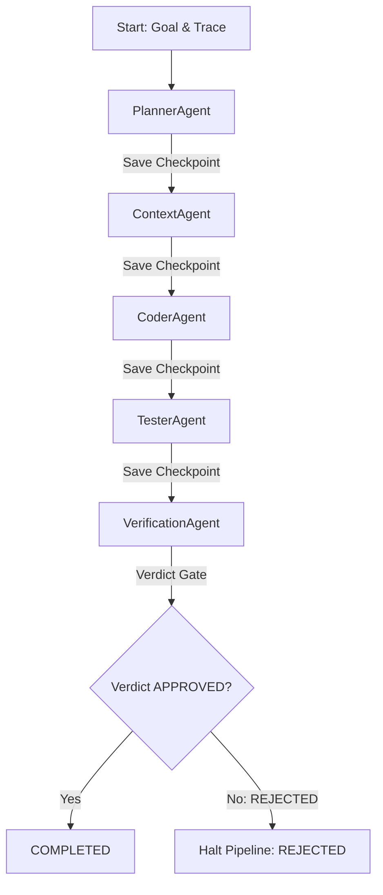

# AgentOrchestrator Flow Implementation Report - Phase 11F

This report describes the architecture, design choices, and implementation details for the production-ready `AgentOrchestrator` flow in the BBC-AOS platform.

---

## 1. Overview and Design

The `AgentOrchestrator` coordinates the entire sequential execution pipeline of agents. It ensures strictly coordinated agent progression, checkpointing, error recovery, rollback, and auditing.

### Sequential Execution Chain
Agents run strictly in the topological order:
`PlannerAgent` $\rightarrow$ `ContextAgent` $\rightarrow$ `CoderAgent` $\rightarrow$ `TesterAgent` $\rightarrow$ `VerificationAgent`

### Core Engineering Requirements
1. **Coordination Isolation:** Sole coordinator of stages. No direct peer-to-peer agent communication.
2. **Metadata Propagation:** Every stage receives the propagated `trace_id`, `replay_id`, and `deterministic_hash`.
3. **Immutable Checkpoints:** Serialized deep-copy execution checkpoints are created after every stage.
4. **Execution Flow Control:**
   * **Resume:** Load from an active execution record or serialized checkpoint and continue from the next uncompleted stage.
   * **Rollback:** Reset the execution state back to a previous stage checkpoint, clearing later states.
5. **Immediate Rejection Gate:** Any `REJECTED` verdict from `VerificationAgent` immediately halts pipeline execution.
6. **Robust Error Handling:** transient exception catches with up to 3 retries per stage before execution fails.
7. **Telemetry & Auditing:** Update the `StateManager` metrics and append events to `IntegrationAuditLog` after every stage.

---

## 2. Component Architecture

The orchestrator operates as a transaction manager:

### Checkpoint and Rollback Logic
* **`_save_checkpoint(stage_name, execution)`**: Saves deep-copied outputs, retry counts, and context states into the `checkpoints` map.
* **`rollback_to_checkpoint(trace_id, replay_id, target_stage)`**: Reverts the active execution state to the `target_stage` checkpoint and deletes all subsequent stage checkpoints.
* **`rollback_execution(trace_id, replay_id, target_stage)`**: Invokes `rollback_to_checkpoint` and then immediately resumes execution.
* **`resume_from_checkpoint(checkpoint)`**: Deserializes state variables and launches execution.

---

## 3. Metrics and Telemetry

Telemetry is published at the end of each stage:
1. **`StateManager`:** Increments `data_processed` with payload size, `files_processed` during coder, and `recipes_created` during verification.
2. **`IntegrationAuditLog`:** Logs trace audit details ensuring complete pipeline transparency.
