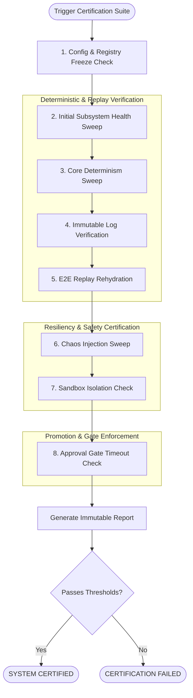

# Production Certification Architecture - Phase 10A

This document details the final production certification framework for the BBC-AOS system, coordinating validation across the eight core certification domains.

## 1. Certification Domains

Certification ensures system stability, safety, and strict compliance across the following areas:

1. **Determinism Certification:** Enforces that mathematical outputs, Shannon chaos states, and aura values do not drift across execution runs (variance = 0).
2. **Replay Certification:** Confirms that any transaction can be reconstructed from append-only logs byte-for-byte, matching the original `deterministic_hash`.
3. **Integration Certification:** Validates that all cross-subsystem communication passes broker validations at the `IntegrationOrchestrator`.
4. **Failure Recovery Certification:** Verifies that budget, exception, and directory breaches correctly trigger checkpoint rollback and escalation gates.
5. **Memory Certification:** Confirms that memory records are strictly append-only, immutable, and versioned.
6. **Human Knowledge Certification:** Ensures local note isolation, proposal-only changes, and manual approval gate enforcement.
7. **Security Certification:** Verifies directory sandboxing and blocks unauthorized command injections.
8. **Production Deployment Certification:** Validates graceful shutdowns, deterministic startups, and health sweeps.

---

## 2. Certification Pipeline Diagram

The following diagram maps the execution flow of the E2E certification pipeline:

