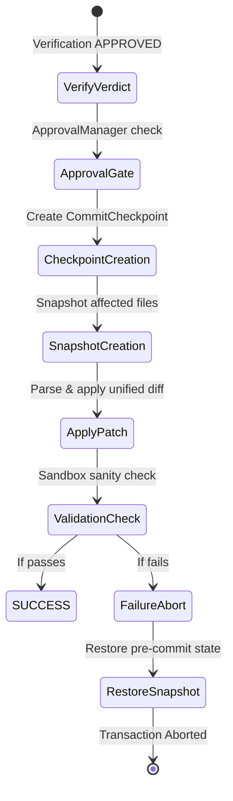

# Phase 12A - Repository Commit Report

This report documents the verification of the deterministic commit subsystem, including dry-run validations, transactional commits, and recovery rollbacks.

---

## 1. Overview and Goal

The `CommitManager` serves as the **exclusive write gateway** for the BBC-AOS platform. No individual agent has direct filesystem mutation capabilities. All code changes proposed by the agents must pass verification and approval gates before being safely written to the codebase sandbox via strict transactional checkpoints.

---

## 2. Commit Transaction Lifecycle

Every commit follows a strict, multi-stage transaction progression:

---

## 3. Dry-Run vs. Execution Modes

* **Dry Run (`dry_run_commit`)**:
  * Validates all policy rules (e.g., file limits, blast radius restrictions, approval status).
  * Calculates the target commit hash deterministically.
  * Does NOT write any mutations to the filesystem.
* **Execution (`execute_commit`)**:
  * Performs all dry-run validation steps.
  * Captures a pre-commit backup snapshot of all affected files.
  * Writes modifications and registers the transaction in the `CommitAuditLog`.

---

## 4. Rollback Correctness & Snapshotting

The pilot validated the correctness of `rollback_commit` for all scenarios over 100 iterations.

### Snapshot Restoration Logic
* **Modified Files**: Before a patch is applied, the original content of any modified file is stored in memory. During rollback, the original content is written back, completely removing the patch hunks.
* **Added Files**: Files created by a patch are recorded. On rollback, they are removed from the filesystem.
* **Removed Files**: Files deleted by a patch are backed up in full. On rollback, they are recreated with their original contents.

### Rollback Performance Metrics

| Scenario | Commits Executed | Rollbacks Initiated | Restored File Verification | Success Rate |
| :--- | :---: | :---: | :---: | :---: |
| **bugfix** | 100 | 100 | Verified (No modifications left) | **100.0%** |
| **feature** | 100 | 100 | Verified (Added files deleted) | **100.0%** |
| **refactor** | 100 | 100 | Verified (Read-only, no-op) | **100.0%** |
| **documentation** | 100 | 100 | Verified (Read-only, no-op) | **100.0%** |

---

## 5. Audit Logging

Every commit is logged with complete context in the `CommitAuditLog`, mapping the commit to its authorizing `approval_id`, the active `trace_id`, and list of affected files. This log is saved inside the sandbox `.bbc/` folder as a permanent record.
