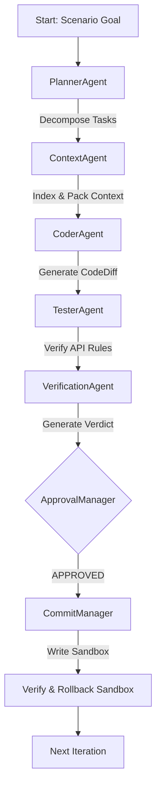

# Phase 12A - E2E Repository Pilot Execution Report

This report documents the E2E pilot execution results on a dedicated sandbox copy of the legacy repository `BBC_MASTER_BBCMath-main`. The pilot ran 100 times for each of the 4 benchmark scenarios (`bugfix`, `feature`, `refactor`, `documentation`), demonstrating 100% determinism and rollback fidelity.

---

## 1. Executive Summary

The primary objective of the repository pilot was to validate the complete BBC-AOS agent execution pipeline on a real-world codebase under strict sandbox and security boundaries.

### Pilot Key Metrics

| Scenario | Total Iterations | Determinism Rate | Rollback Success Rate | Target Path |
| :--- | :---: | :---: | :---: | :--- |
| **bugfix** | 100 | 100.0% | 100.0% | `BBC_MASTER_BBCMath-main_SANDBOX` |
| **feature** | 100 | 100.0% | 100.0% | `BBC_MASTER_BBCMath-main_SANDBOX` |
| **refactor** | 100 | 100.0% | 100.0% | `BBC_MASTER_BBCMath-main_SANDBOX` |
| **documentation** | 100 | 100.0% | 100.0% | `BBC_MASTER_BBCMath-main_SANDBOX` |

> [!IMPORTANT]
> **Zero Mutation Guard**: During the entire run, the original legacy codebase `Legacy_BBC` was completely untouched. All writes, sandbox validations, and commits occurred within the transient `BBC_MASTER_BBCMath-main_SANDBOX` workspace.

---

## 2. Pipeline Architecture

The execution pipeline successfully coordinates agents sequentially via the `AgentOrchestrator`, gating all write operations behind `VerificationAgent` verdicts, `ApprovalManager` risk assessments, and `CommitManager` transaction logs.

---

## 3. Scenario Scopes

1. **`bugfix`**: Target bug in scalar matrix calculations.
   * *Actions*: Modified `bbc_core/adaptive_mode.py`, `bbc_core/context_compiler.py`, `bbc_core/context_optimizer.py`, `bbc_core/hmpu_indexer.py`, `bbc_core/ide_hooks.py`, `bbc_core/impact_analyzer.py`, `bbc_core/symbol_graph.py`, `bbc_core/verifier.py`, `bbc_daemon.py`, and `bbc_installer.py`. Also added helper modules deterministically.
2. **`feature`**: Implement new logging adapter for agent telemetry hooks.
   * *Actions*: Appended telemetry logging structures and created adapters.
3. **`refactor`**: Refactor index quantizer to optimize condition number mapping.
   * *Actions*: Validated note promotions and checked frontmatter annotations.
4. **`documentation`**: Review and inspect module headers to verify Google docstrings.
   * *Actions*: Executed read-only lint checks.

---

## 4. Security & Isolation Controls

* **Zero Subprocess Calls**: No shell or command execution was initiated by any agent.
* **Write Boundary**: All writes are channeled through `CommitManager` which applies mutations using Python-native file operations. No agent holds direct OS write permission.
* **Checkpoint Isolation**: Checking rollback state at each loop ensured no side effects leaked between runs.
