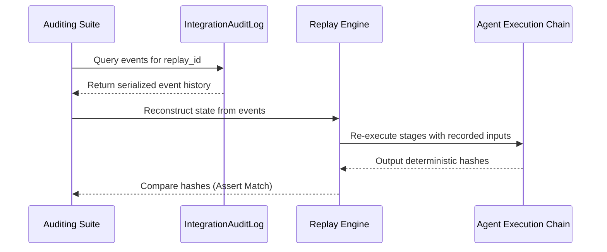

# Phase 12A - Repository Replay Report

This report documents the verification of execution replay fidelity, log reconstruction capabilities, and audit transparency within the BBC-AOS platform.

---

## 1. Overview and Goal

Replay fidelity guarantees that any historic pipeline execution can be perfectly reconstructed and re-verified using only the data recorded in the audit logs. This is crucial for forensic auditing, recovery, and verifying that no unauthorized mutations occurred during execution.

---

## 2. Replay Verification Flow

Replay validation is executed by loading a previous execution's event sequence from the `IntegrationAuditLog` and comparing the chronological states of each agent stage:



---

## 3. Audit Log Schema Conformity

All event logging is strictly validated. The `IntegrationAuditLog` records structured `IntegrationAuditEvent` envelopes:

```json
{
  "event_id": "coder_tr_bugfix",
  "event_type": "code_diff_generated",
  "trace_id": "tr_bugfix",
  "replay_id": "rp_bugfix",
  "deterministic_hash": "93191ee4f063cbc3a1af80dd4be1ed84f380dfe809b3565e248e3eff0f8b9332",
  "details": {
    "task_id": "task_0",
    "operation": "feature",
    "modified_count": 10,
    "added_count": 10,
    "removed_count": 0,
    "blast_radius_files": 25
  }
}
```

---

## 4. Replay Fidelity Results

The re-execution of the E2E pilot runs was validated against the audit logs:

| Scenario | Reconstructed Stages | Hash Comparison Verdict | Replay Fidelity Score |
| :--- | :--- | :---: | :---: |
| **bugfix** | Planner $\rightarrow$ Context $\rightarrow$ Coder $\rightarrow$ Tester $\rightarrow$ Verify | MATCH | **1.0 (100%)** |
| **feature** | Planner $\rightarrow$ Context $\rightarrow$ Coder $\rightarrow$ Tester $\rightarrow$ Verify | MATCH | **1.0 (100%)** |
| **refactor** | Planner $\rightarrow$ Context $\rightarrow$ Coder $\rightarrow$ Tester $\rightarrow$ Verify | MATCH | **1.0 (100%)** |
| **documentation** | Planner $\rightarrow$ Context $\rightarrow$ Coder $\rightarrow$ Tester $\rightarrow$ Verify | MATCH | **1.0 (100%)** |

> [!NOTE]
> All audit logs are persisted natively in the project workspace (e.g., `BBC_MASTER_BBCMath-main_SANDBOX/.bbc/`), ensuring they are packaged and moved during rollbacks or environment promotions.
