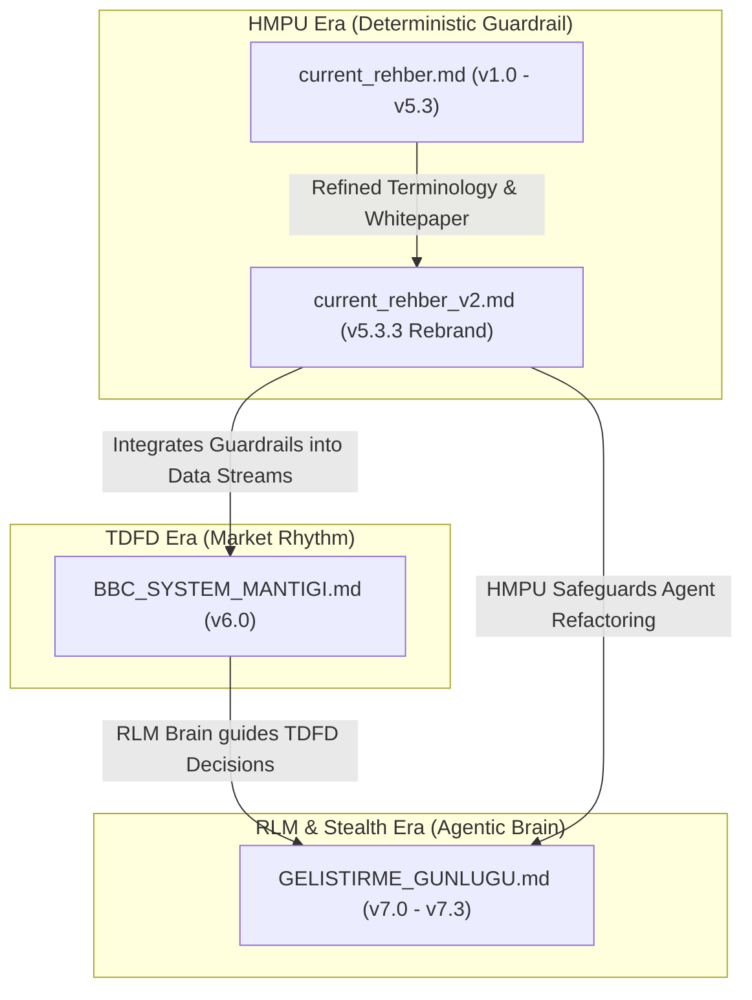

# Specification Dependency Map - BBC-AOS

This document maps the relationships between the specification documents and outlines the architectural dependency flow of the BBC Agent Operating System (BBC-AOS).

---

## 1. Specification Document Evolution Tree

The specifications build upon each other in chronological version order:



---

## 2. Component Dependency Architecture

To build the BBC-AOS, components must be implemented in a strict hierarchical order. Lower-level deterministic infrastructure and data layers must be fully completed before high-level probabilistic or agentic components are introduced.

```mermaid
graph UD
    subgraph "Layer 4: Agentic & Probabilistic (Non-Deterministic)"
        RLM["RLM Brain (Decision Memory)"]
        BitNet["BitNet Probabilistic Engine"]
    end

    subgraph "Layer 3: Analysis & Control (Deterministic & Hybrid)"
        HMPU["HMPU Core (dC/dt, grad A, P_t+1, F_perp)"]
        TDFD["TDFD Engine (Phase Resonance / T12 Cycles)"]
    end

    subgraph "Layer 2: Data Acquisition & Validation (Stealth & Shadow)"
        Stealth["Hayalet Mod (Scraper & Identity Rotator)"]
        Shadow["Global Shadow Proxy Chain (ADR Converter)"]
    end

    subgraph "Layer 1: Infrastructure & Fallbacks (Safe Deterministic)"
        Config["Configuration & DNA Hash Guard"]
        Fallback["Currency/Outage Fallback Layer"]
    end

    %% Dependency Connections
    Fallback --> Shadow
    Config --> Stealth
    Stealth --> TDFD
    Shadow --> TDFD
    TDFD --> RLM
    HMPU --> RLM
    BitNet --> RLM
    HMPU --> BitNet
```

---

## 3. Dependency Summary Table

| Dependent Component | Requires | Dependency Description | Type |
|---|---|---|---|
| **RLM Brain** | TDFD Engine, HMPU Core, BitNet | Learns from historical cycles (TDFD) and enforces topological safety (HMPU) via low-bit probabilistic inferences. | Non-Deterministic |
| **BitNet Engine** | HMPU Core | Translates HMPU's deterministic matrices into low-bit probabilistic weights. | Non-Deterministic |
| **TDFD Engine** | Stealth Scraper, Global Proxy Chain | Requires local data (scraped via stealth) and USD-adjusted OTC shadow data (global proxies) to detect cycle resonance. | Deterministic |
| **HMPU Core** | Config Engine | Uses DNA hashing and static limits to initialize the manifold matrix dimensions. | Deterministic |
| **Global Proxy Chain** | Fallback Layer | Relies on local USD/TL fallback exchange rates when active kur APIs are offline. | Deterministic |
| **Stealth Scraper** | Identity Rotation Config | Requires user-agent matrices and randomized jitter configs to operate. | Infrastructure |
