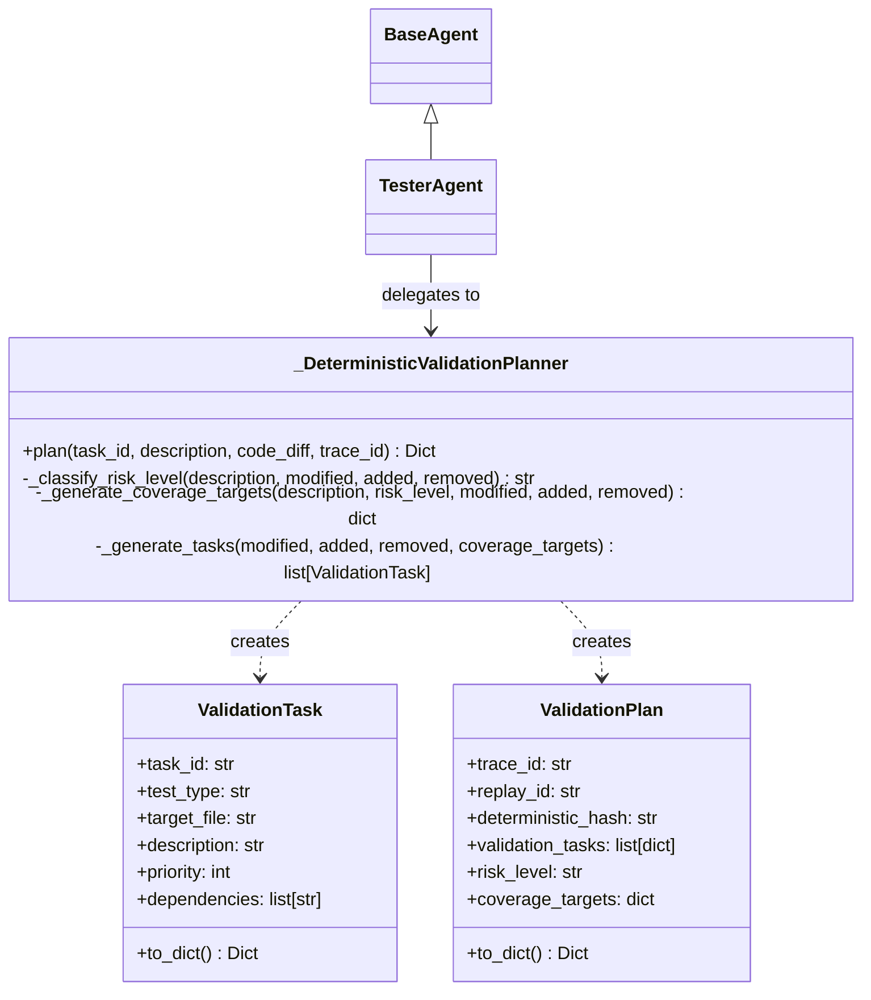

# TesterAgent Implementation Report - Phase 11D

This report provides the architecture, design choices, and implementation details for the production-ready `TesterAgent` under the BBC-AOS platform.

---

## 1. Overview and Intent

The `TesterAgent` is the platform's verification planner. It is responsible for analyzing code modification proposals (`CodeDiff`) received from the `CoderAgent` and generating a deterministic DAG of executable validation tasks.

### Core Philosophy

* **Planner, Not Executor:** In accordance with the platform's safety laws, the `TesterAgent` does not execute tests, invoke subprocesses, or access the filesystem directly. It solely generates the execution plan.
* **100% Determinism:** The planning algorithm uses SHA-256 seeding to ensure identical validation plans and task lists are generated for the same inputs.
* **Traceable Interactions:** All planning cycles route outputs through the `ValidationGateway` and append dispatch records to the `IntegrationAuditLog`.

---

## 2. Component Design

The implementation is structured into three main classes within [tester_agent.py](file:///C:/Users/90535/.gemini/antigravity/scratch/BBC_AOS_Wiki/bbc_aos/agents/tester_agent.py):

### A. Immutable Schemas
* **`ValidationTask`**: An immutable class using Python `__slots__` and overriding `__setattr__` to represent a single test execution unit.
* **`ValidationPlan`**: An immutable class holding the complete validation plan structure.

### B. Deterministic Planner (`_DeterministicValidationPlanner`)
* **Risk Classification:** Evaluates natural language task descriptions using regex word-boundary checks (`\bkeyword\b`) alongside change metrics (such as deletions or file counts) to output one of the four risk levels: `LOW`, `MEDIUM`, `HIGH`, or `CRITICAL`.
* **Coverage Target Mapping:** Dynamically resolves target categories (`syntax`, `unit`, `integration`, `regression`, `replay`).
* **Validation Tasks Generator:** Iterates through affected files topological-order (syntax first, then unit, etc.) to form linear validation chains. Capped at a maximum of 50 tasks with maximum dependency depth of 5.
* **Stable Ordering:** Sorts tasks using a deterministic dual-key system: `(x["priority"], x["task_id"])`.

---

## 3. Sandboxing and Safety Enforcements

The `TesterAgent` adheres to all global platform laws:
1. **No Filesystem Access:** No use of `open()`, `os.listdir()`, or `pathlib` within the planner.
2. **No Subprocess Invocation:** No execution of python unit tests, pytest, or external tools directly.
3. **No Direct Communication:** Operates strictly via parameters provided during orchestrator dispatch.
4. **Validation Gateway:** Calls `ValidationGateway().validate_output()` before committing outputs.
5. **Traceable Logs:** Appends signed `IntegrationAuditEvent` events to `IntegrationAuditLog` on success.
