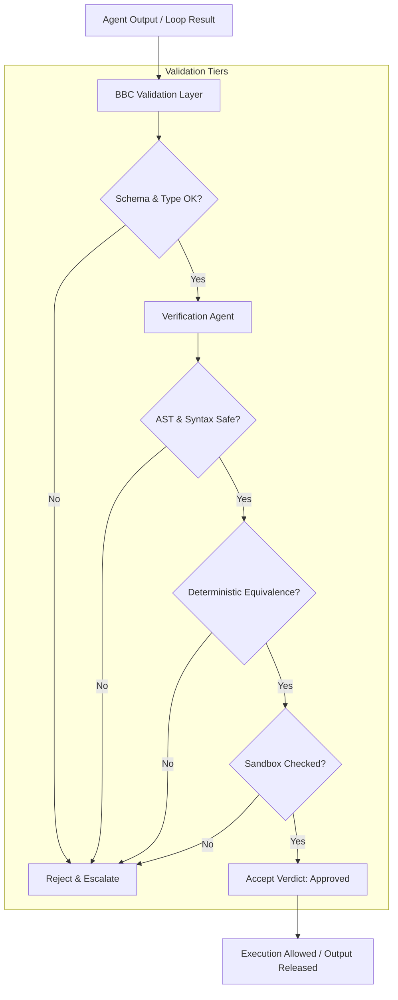

# Validation Flow - Phase 9A

This document details the validation flow and output verification checks.

## 1. Validation Flow Sequence

All outputs generated by agents or execution loops are subjected to a multi-stage validation check:

1. **Output Submission:** The raw agent output or loop execution result is sent to the `BBC Validation Layer`.
2. **Schema & Syntax Check:** The validation layer parses the output to verify JSON-RPC conformity and type matching.
3. **Dispatch to Verification:** The validation layer invokes the `VerificationAgent`.
4. **Verification Evaluation:** The `VerificationAgent` performs:
   * *AST verification* (ensuring no illegal imports or code structures).
   * *Equivalence validation* (verifying outputs match core determinism calculations).
   * *Safety checks* (scanning for unauthorized file paths or sandbox directory violations).
5. **Validation Verdict:** A pass/fail decision is rendered. If fail, the result is rejected and an escalation event is raised; if pass, the execution proceeds.

---

## 2. Validation Flow Diagram

