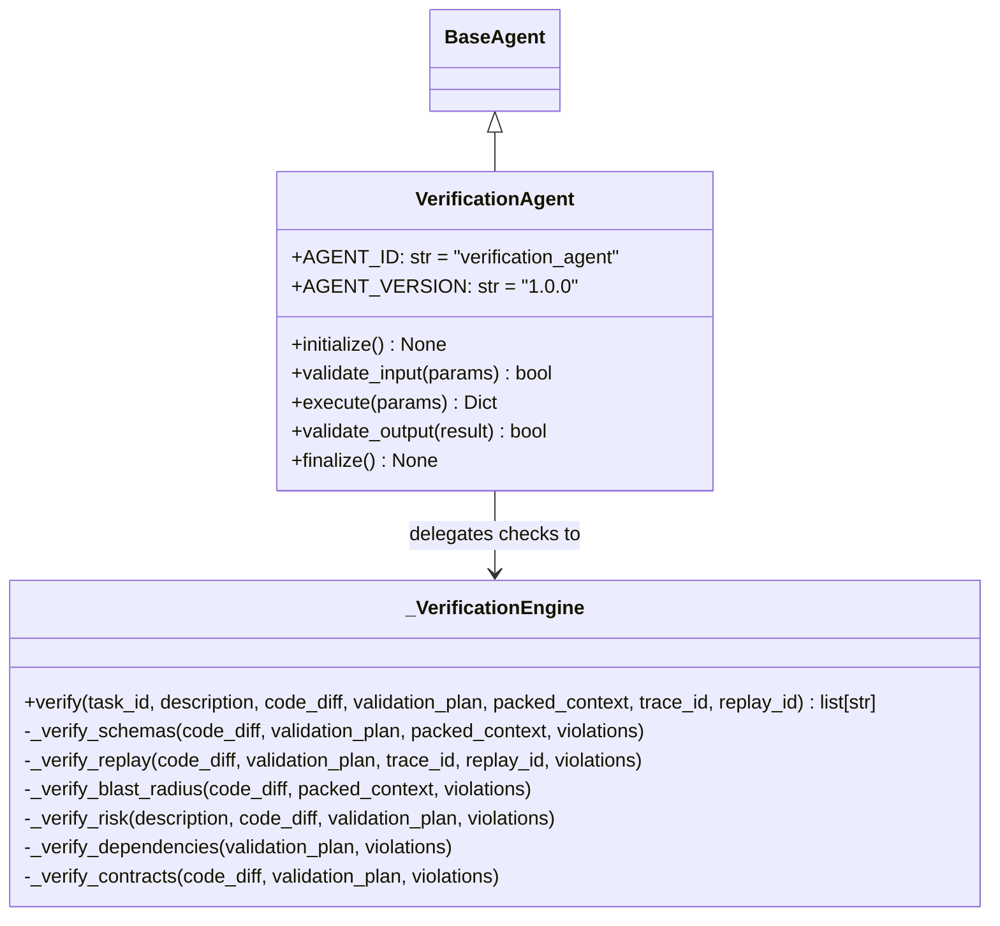

# VerificationAgent Implementation Report - Phase 11E

This report provides the architecture, design choices, and implementation details for the production-ready `VerificationAgent` under the BBC-AOS platform.

---

## 1. Overview and Intent

The `VerificationAgent` is the final deterministic gate in the code generation and testing pipeline. It is responsible for analyzing the inputs from other agents (`ContextAgent`, `CoderAgent`, and `TesterAgent`), verifying their structural schemas, trace replay IDs, file blast radius scopes, and contract constraints, and outputting an overall verdict of `APPROVED` or `REJECTED`.

### Core Philosophy

* **Final Approval Gate:** Any contract breach, schema anomaly, dependency cycle, depth violation (> 5), or blast radius violation immediately triggers a `REJECTED` verdict and generates a structured list of violations.
* **100% Deterministic Engine:** Runs purely as a stateless, side-effect-free evaluator. It does not perform filesystem operations or execute code, ensuring zero behavioral drift.
* **Full Auditability:** Every execution cycle is self-validated through the `ValidationGateway` and appends certified `IntegrationAuditEvent` events to the `IntegrationAuditLog`.

---

## 2. Component Design

The implementation is structured into three main classes within [verification_agent.py](file:///C:/Users/90535/Desktop/BBC_AOS_Wiki/bbc_aos/agents/verification_agent.py):

### A. Verification Engine (`_VerificationEngine`)
The engine runs six levels of checks sequentially:
1. **Schema Check:** Verifies fields and types in `CodeDiff`, `ValidationPlan`, and `packed_context` dictionaries.
2. **Replay ID Check:** Asserts that trace and replay IDs match and propagate correctly across all payloads.
3. **Blast Radius Check:** Enforces that affected files in `CodeDiff` are strictly contained within `packed_context`'s `selected_files`.
4. **Risk Level Check:** Classifies risk level using natural language description keyword matching and file counts, and asserts it matches the validation plan's risk level.
5. **Dependency Check:** Inspects the validation plan tasks to confirm they form a valid DAG (no cycles), references exist, and depth is $\le 5$.
6. **Contract Check:** Confirms hex hash lengths and verifies that validation tasks are sorted by priority and `task_id` (stable sorting check).

---

## 3. Telemetry and Logs

Upon successful completion of the checks:
* An audit event of type `contract_verified` is created.
* It is appended to the `IntegrationAuditLog` containing trace details, verdict status, risk level, and violation count.
* The output payload is certified by routing it through the `ValidationGateway` check before being returned.
