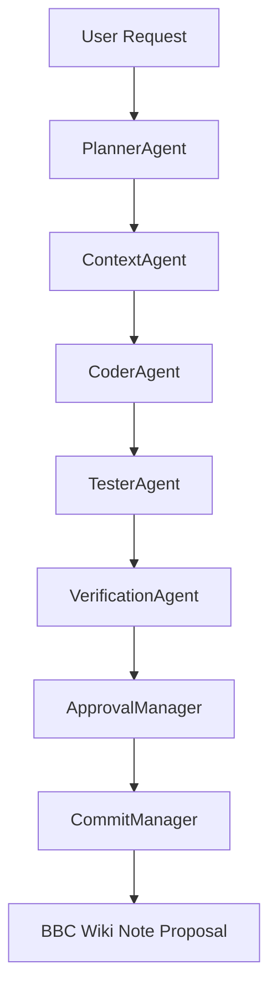

# BBC-AOS Silent Runtime Model

BBC-AOS operates on a silent-by-default execution model. Agents work internally without displaying verbose details, keeping the user focused on high-level goals and approval checkpoints.

## 1. Silent Background Execution

When `bbc ask` is executed, the following pipeline runs in the background:

1. **PlannerAgent**: Decomposes user goal into a list of structured task nodes.
2. **ContextAgent**: Maps task nodes to minimal required codebase symbols and files, filtering out irrelevant code to optimize context size.
3. **CoderAgent**: Drafts code modifications in a temporary workspace sandbox.
4. **TesterAgent**: Runs local test suites and builds test specs to verify correctness.
5. **VerificationAgent**: Checks safety constraints, verifying that no unknown symbols or files were accessed or modified.
6. **ApprovalManager**: Evaluates changes against risk policy (LOW, MEDIUM, HIGH, CRITICAL).
7. **CommitManager**: Upon approval, commits the changes to local git.
8. **Wiki Proposal**: Creates a review proposal note under `BBC_Wiki/Approvals/`.

---

## 2. Dynamic Safety Boundaries & Failsafes

The loop engine controls retries and recovery dynamically in the background:
* **Nested Loops Capped**: Maximum loop depth is strictly limited (`MAX_LOOP_DEPTH = 1`).
* **Iteration Capped**: Max loops per task execution is strictly limited (`MAX_ITERATIONS = 5`).
* **Token Limits**: Dynamically tracked at the state level; warnings are logged when thresholds are breached.
* **Sandbox Isolation**: All file edits and executions are sandboxed; any directory escape triggers a safety breach error and immediately aborts the pipeline.

---

## 3. Developer Visibility Interface

To prevent information overload, the developer is presented only with critical execution checkpoints:
* **Task Status Updates**: High-level stage progress indicator (analyzed project, selected context, verified blast radius, etc.).
* **Risk Level Indicator**: LOW (Auto-commit), MEDIUM/HIGH/CRITICAL (Requires manual approval prompt).
* **Approval Gates**: Prompts for commit authorization when risk rules require it.
* **Result Footprints**: Prints the final commit hash, replay ID, and wiki note proposal ID.
